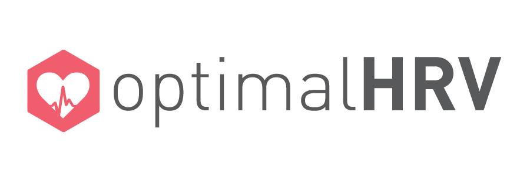

# OptimalHRV Documentation

     

 
    <b>Comprehensive Documentation for OptimalHRV Platform</b>

    

    <a href="https://www.optimalhrv.com/" target="_blank">Official Website</a> | 
    <a href="https://optimalhrv.com/devices" target="_blank">HRV Reader</a> | 
    <a href="#" target="_blank">Documentation</a>

    
    

# What is OptimalHRV?

**OptimalHRV** is a comprehensive heart rate variability (HRV) monitoring platform that provides quantitative measurement and biofeedback training for individuals, professionals, and organizations. Our ecosystem includes:

- **📱 Mobile App**: iOS/Android application for personal HRV tracking and biofeedback training
- **📊 Web Dashboard**: Professional platform for coaches, clinicians, and organizational managers
- **🔬 HRV Reader**: Precision Bluetooth/ANT+ device for accurate R-R interval measurement
- **🧘 Biofeedback Training**: In-app modules for recovery enhancement and stress management

# Documentation Structure

This documentation covers the complete OptimalHRV ecosystem:

## 📱 [Mobile App Guide](docs/mobile-app.md)
- Device connection and setup
- Taking HRV readings
- Biofeedback training sessions
- Troubleshooting and support

## 📊 [Web Dashboard Manual](docs/web-dashboard.md)
- Organizational setup and user management
- Group monitoring and analytics
- Professional features for coaches and clinicians

## 🔬 [HRV Reader Manual](docs/Others/user-manual.md)
- Device specifications and operation
- Charging and maintenance
- Technical specifications

## 📋 [Additional Resources](docs/Others/support.md)
- Subscription management
- Technical support
- Frequently asked questions

# Getting Started

1. **📱 Download the App**: Get the OptimalHRV app from the App Store or Google Play
2. **🔬 Get an HRV Reader**: Purchase the Optimal HRV Reader or use a compatible device
3. **📖 Follow the Guides**: Use our comprehensive documentation to get started
4. **💬 Get Support**: Contact our support team if you need assistance

# Features

- **Accurate HRV Measurement**: Professional-grade R-R interval detection
- **Real-time Biofeedback**: Evidence-based breathing and meditation training
- **Professional Dashboard**: Organizational management for coaches and clinicians
- **Cross-platform**: iOS, Android, and web-based solutions
- **Secure & Private**: HIPAA-compliant data handling for professional use
- **Research-backed**: Based on latest HRV science and best practices

# Support & Community

- **📧 Technical Support**: [support@optimalhrv.com](mailto:support@optimalhrv.com)
- **🌐 Website**: [www.optimalhrv.com](https://www.optimalhrv.com)
- **📖 Knowledge Base**: Browse our comprehensive documentation
- **🏥 Professional Services**: Organizational setup and training available

# License & Copyright

© 2025 by Optimal, LLC. All rights reserved.

This documentation is built with [Docsify](https://docsify.js.org/) and the [docsify-darklight-theme](https://github.com/boopathikumar018/docsify-darklight-theme).

---

*Heart Rate Variability monitoring for optimal health and performance.*