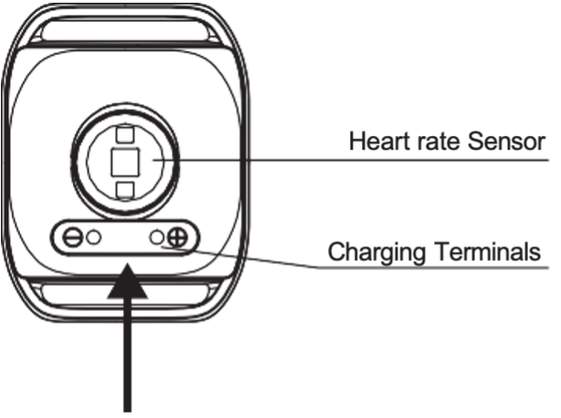

# Optimal HRV Reader Manual

# Introduction

The Reader transmits real-time heart rate variability (HRV) data through BLE or ANT+ to the Optimal HRV app on your smartphone. This product provides you with HRV data for personal use and is not meant to replace any medical advice.

# Accessories

  <figure style="margin: 0 20px;">
    
    <figcaption>Optimal HRV Reader</figcaption>
  </figure>
  <figure style="margin: 0 20px;">
    
    <figcaption>Charging Cable</figcaption>
  </figure>
  <figure style="margin: 0 20px;">
    
    <figcaption>User Manual</figcaption>
  </figure>

# Basic Parameters

- Product size: 46.5 x 36 x 14mm
- Host weight: 12.3g
- Power: 90mAh Rechargeable lithium battery
- Battery life: 16 hours for continuous heart rate monitoring
- Water resistance: IP67
- Working temperature: 0℃~40℃
- Transmission: ANT+, BLE

# Function and Operation

- **Turn-on:** Press the start-up button; the LED light will flash blue quickly until the heart rate was found.
- **Turn-off:** Hold the start-up button; The LED will flash red light and vibrates, then enters the shutdown state.

**Heart Rate Indicating:**

*Max Heart Rate (MHR) = 180 (default)

| Zone        | Color       |  Range (Default) |
| ----------- | ----------- | -----------      |
| Zone 1      | Blue        | Below 60% MHR    |
| Zone 2      | Green       | 61%~70% MHR      |
| Zone 3      | Yellow      | 71%~80% MHR      |
| Zone 4      | Purple      | 81% ~ 90% MHR    |
| Zone 5      | Red         | Above 91% MHR    |

Besides use with the Optimal HRV app, you can use the
Reader to monitor heart rate during exercise for
stressful events.

**Heart rate alarm**: if the heart rate exceeds the
maximum value, the sensor will vibrate 3 times
continuously

**Power:**

- Low Power Alert: LED flashes red and green alternately, and vibrates once.
- Charging: LED flashes green and will stay on with green when fully charged.

   

**Wearing:** Wear armband on the upper portion of the forearm. Sensor should be on the inside or top of forearm. It should be worn snug enough not to move on your arm but NOT so tight that it restricts arm circulation.

# Initial Setup

1. Find and download the Optimal HRV app in the appropriate app store.
2. Subscribe or Log In into the Optimal HRV app.
3. Ensure the Bluetooth function on your phone is turned on.
4. Choose your desired activity in the app.
5. Turn on Optimal HRV Reader.
6. Select: Setup new device...
7. Optimal HRV Reader will show on the Devices Page.
8. Press Continue at the bottom of the page.
9. Hit Start to begin the exercise.

# Applicable Models

- iOS 9.0 version and above iPhone 5s and above.
- Any Bluetooth 4.0 enabled Android device with Android 4.3 and above.

# Disclaimer

- The information contained in this manual is for reference only. The product described above may be subject to alteration owing to the manufacturer's continuing research and development plans without making an announcement in advance.
- We shall not bear any legal responsibility for any direct or indirect accidental or special damages, losses, and expenses arising from or in connection with this manual or the contained product.
