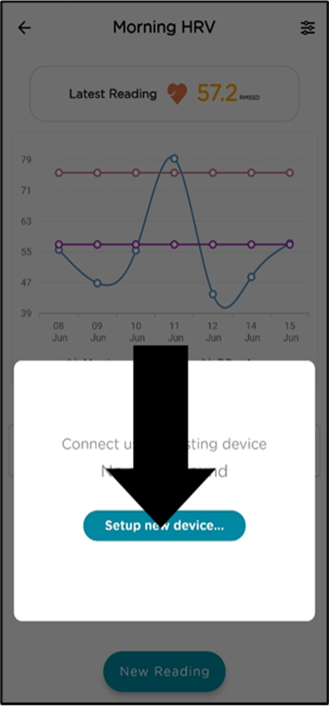
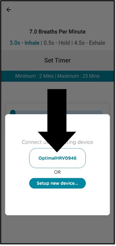
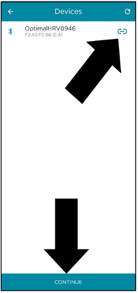
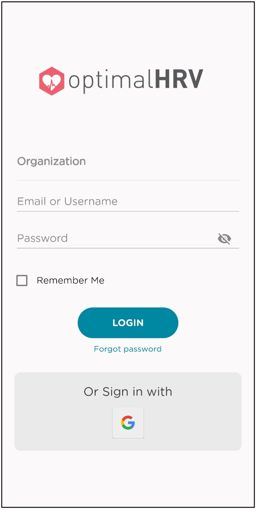
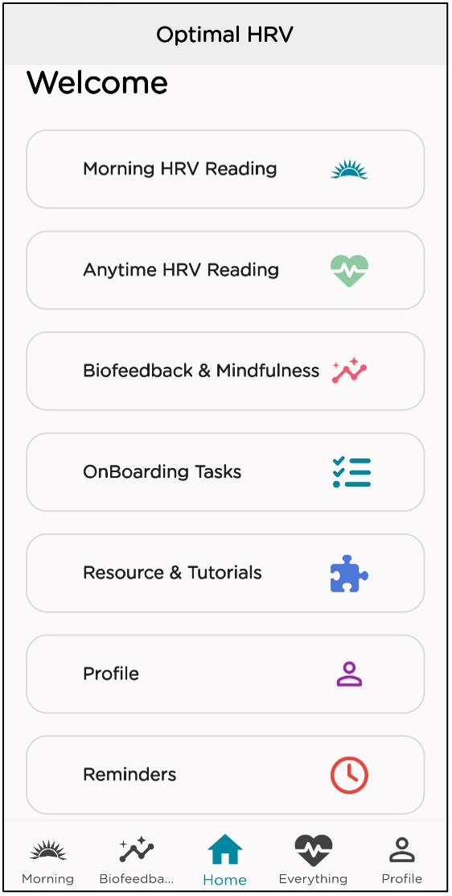
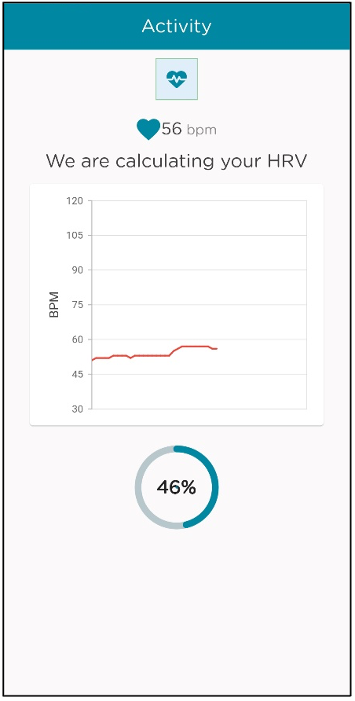
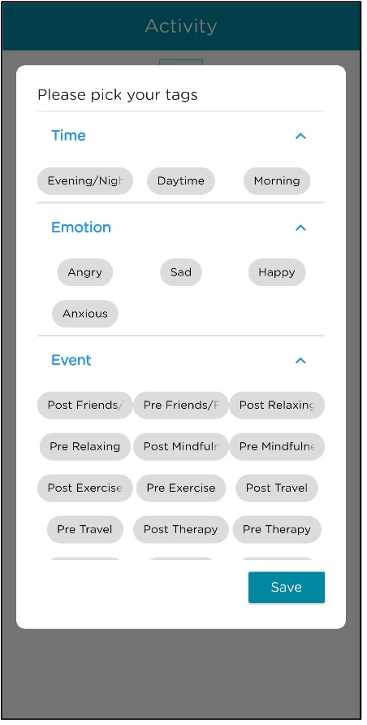
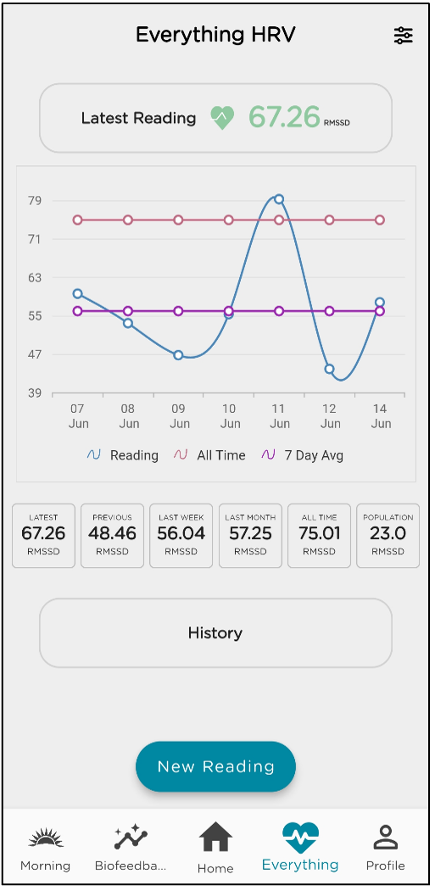
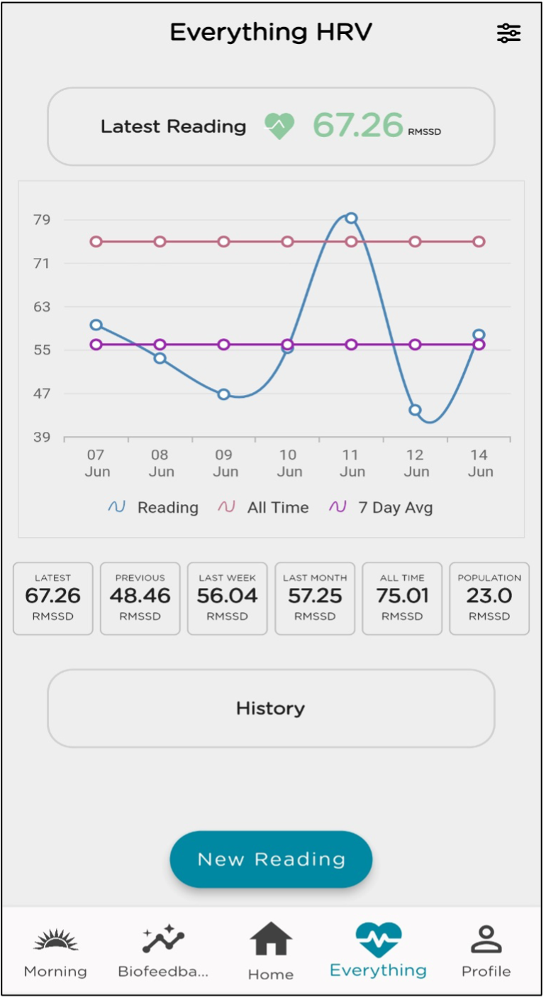
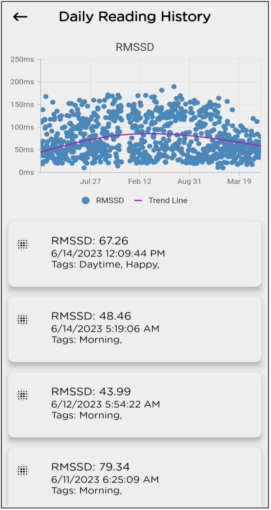

# Using the Optimal HRV app

Working with the [Optimal HRV Reader](https://www.optimalhrv.com/devices), our app provides a way to quantitatively measure Heart Rate Variability for yourself, for your employees, or for those you are caring for, as well as enhancing recovery with our in-app biofeedback training modules.

> Note : Please read before you use the Optimal HRV app.
> - To utilize the Optimal HRV app, you will need an HRV Reader. The application is suitable for all heart rate monitors that precisely gauge R-R intervals, possess Bluetooth 4.0 or ANT+, and allow external apps to connect.
> - While we highly recommend the Optimal HRV Reader, you can find a list of other compatible devices here. 
> - Whatever device you decide to use should be your consistent device. Different devices may show different results and can not be compared to one another. 
> - Connect the Bluetooth reader through the app itself as you start to take a reading or do a training session. Do not connect through the Bluetooth menu on your phone.

## Connecting an HRV Reader and Starting an Actvity

- As a reminder - Connect the Bluetooth reader through the app itself. Do not connect through the Bluetooth menu on your phone.
- When you start an activity the app will display a menu that asks you to “Setup new device” or to select a previously connected device.
- When you close the app, the device will automatically disconnect. Each time to open the app after closing it you will need to connect a new device. Optimal HRV does this to ensure the best connection possible. 
- Make sure your HRV reader is turned on and you are wearing it according to device recommendations. 
- You will see your reader show up on a link of devices. 
- Hit the (-) button and it will turn from gray to blue. 
- Hit the “Continue” button for a 3-minute reading this will automatically start the reading
- For Biofeedback and Mindfulness activites you will get a start page to allow you to get comfortable before taking a reading

## Optimal HRV Login Instructions
- <u>Login</u>: To log in, you can use your Apple ID/Google Account or the username and password provided through your organization, professional, or Optimal team. This could be in the form of an email address or a username. 
- Unless you got different instructions from the Optimal Team or a professional you are working with, please leave the “Organization” login information blank.
- <u>Welcome Menu</u>: Here, you will see all the functionality of the Optimal HRV App. Next, we will explore what you will find on each menu item.

## Optimal HRV Readings Instructions
> Please refer to the [Connecting and HRV Reader and Starting an Activity](mobile-app.md#connecting-an-hrv-reader-and-starting-an-actvity) section to start these activties.

### HRV Readings
- <u>Morning HRV Reading</u>: Morning readings are a consistent baseline for overall health and wellness. We encourage you to put your Bluetooth device next to your phone, alarm clock, or another place that will remind you to take a morning reading.
- <u>Anytime HRV Reading</u>: Anytime readings can be taken anytime to track your HRV throughout the day or experiment on how specific activities, therapies, and events influence your HRV. 
- <u>During Morning and Anytime Readings</u>: During the readings, you will see a chart that displays your heartrate and a timer. Some important points about these three-minute-long readings: 
  - Breath normally: These readings give you a snapshot of how you are doing. If you control your breath, it could change the results. 
  - Keep your position consistent: Your body position can influence your HRV. We encourage users to sit comfortably during the three-minute readings and use this position every time they take a reading. 
- <u>Tags</u>: Tags allow you to attach additional information to your HRV score after a Morning or Anytime Reading. You can tag the time of day, emotional state, events, and substances. Note: Morning readings will automatically highlight the “Morning” tag.

### Results and History
- <u>Results Page</u>: Optimal HRV uses RMSSD or Root Mean Square of the Successive Differences for Morning and Anytime Readings. RMSSD is one of the best-researched HRV metrics to measure the resiliency and health of the nervous system. `The higher the HRV score, the better!`
  - <u>Latest</u>: The results of the reading you just completed or your last reading. 
  - <u>Previous</u>: This result is your HRV score from the second most recent training. Previous readings allow you to pre and post-text how certain activities (i.e., workouts, sleep, work, therapy, mindfulness) impact your HRV by comparing your Latest Reading (post-test) to your Previous (pre-test).
  - <u>Last Week</u>: This result is an average of your HRV scores over the last seven days. Simply put, this result provides insight into how you are doing this week.
  - <u>Last Month</u>: This result is an average of your HRV scores over the last 30 days. This result provides insight into how you are doing this month and can be compared to your weekly and daily scores to indicate which direction your health may be going.
  - <u>All Time</u>: This result is the average of all your HRV scores. All Time average provides you a baseline to compare your other scores. The goal with HRV tracking is to improve or maintain our All time average over time (trying to get your Last Week and Last Month above your All Time average)
  - <u>Population</u>: This score is the average for your age and gender. We provide this average only for informational purposes. Many factors influence HRV, including genetics. `The goal is to improve and maintain your All Time Average over time and not worry about the population norms`.

- <u>History (on the Results Page)</u>: The history button at the bottom of the Results page will take you to a page with a chart of all your readings over time and a list of past readings and tags.

### Biofeedback and Mindfulness
> Please refer to the [Connecting and HRV Reader and Starting an Activity](mobile-app.md#connecting-an-hrv-reader-and-starting-an-actvity) section to start these activties.

## Onboarding, Resources & Tutorial, and Profile Instructions