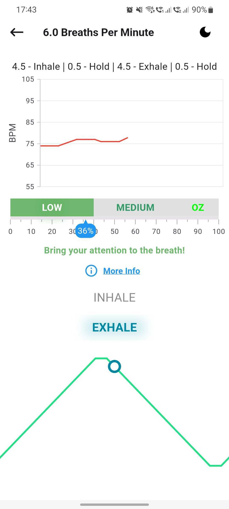
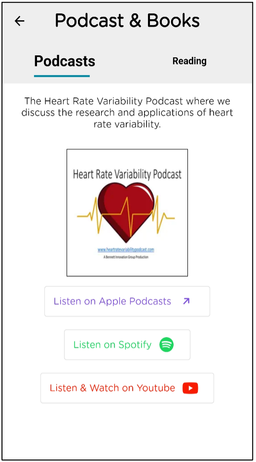

# Using the Optimal HRV app

Working with the [Optimal HRV Reader](https://www.optimalhrv.com/devices), our app provides a way to quantitatively measure Heart Rate Variability for yourself, for your employees, or for those you are caring for, as well as enhancing recovery with our in-app biofeedback training modules.

> Note : Please read before you use the Optimal HRV app.
>
> - To utilize the Optimal HRV app, you will need an HRV Reader. The application is suitable for all heart rate monitors that precisely gauge R-R intervals, possess Bluetooth 4.0 or ANT+, and allow external apps to connect.
> - While we highly recommend the Optimal HRV Reader, you can find a list of other compatible devices here.
> - Whatever device you decide to use should be your consistent device. Different devices may show different results and can not be compared to one another.
> - Connect the Bluetooth reader through the app itself as you start to take a reading or do a training session. Do not connect through the Bluetooth menu on your phone.

## Connecting an HRV Reader and Starting an Actvity

- As a reminder - Connect the Bluetooth reader through the app itself. Do not connect through the Bluetooth menu on your phone.

- When you start an activity, the app will prompt you to allow Bluetooth or location permissions if not already granted.

- If Bluetooth or location services are not enabled, the app will request to turn them on.

- Make sure your HRV reader is turned on and you are wearing it according to device recommendations.

- You will then see the "Bluetooth Devices" sheet. Select your device to automatically start the reading.

- When you close the app, the device will automatically disconnect. Each time to open the app after closing it you will need to connect a new device. Optimal HRV does this to ensure the best connection possible.

## Optimal HRV Login Instructions

- <u>Login</u>: To log in, you can use your Apple ID/Google Account or the username and password provided through your organization, professional, or Optimal team. This could be in the form of an email address or a username.

- Unless you got different instructions from the Optimal Team or a professional you are working with, please leave the “Organization” login information blank.

- <u>Welcome Menu</u>: Here, you will see all the functionality of the Optimal HRV App. Next, we will explore what you will find on each menu item.

## Optimal HRV Readings Instructions

> Please refer to the [Connecting and HRV Reader and Starting an Activity](mobile-app.md#connecting-an-hrv-reader-and-starting-an-actvity) section to start these activties.

### HRV Readings

- <u>Morning HRV Reading</u>: Morning readings are a consistent baseline for overall health and wellness. We encourage you to put your Bluetooth device next to your phone, alarm clock, or another place that will remind you to take a morning reading.

- <u>Anytime HRV Reading</u>: Anytime readings can be taken anytime to track your HRV throughout the day or experiment on how specific activities, therapies, and events influence your HRV.

- <u>During Morning and Anytime Readings</u>: During the readings, you will see a chart that displays your heartrate and a timer. Some important points about these three-minute-long readings:
  - Breath normally: These readings give you a snapshot of how you are doing. If you control your breath, it could change the results.
  - Keep your position consistent: Your body position can influence your HRV. We encourage users to sit comfortably during the three-minute readings and use this position every time they take a reading.
- <u>Tags</u>: Tags allow you to attach additional information to your HRV score after a Morning or Anytime Reading. You can tag the time of day, emotional state, events, and substances. Note: Morning readings will automatically highlight the “Morning” tag.

### Results and History

- <u>Results Page</u>: Optimal HRV uses RMSSD or Root Mean Square of the Successive Differences for Morning and Anytime Readings. RMSSD is one of the best-researched HRV metrics to measure the resiliency and health of the nervous system. `The higher the HRV score, the better!`

  - <u>Latest</u>: The results of the reading you just completed or your last reading.

  - <u>Previous</u>: This result is your HRV score from the second most recent training. Previous readings allow you to pre and post-text how certain activities (i.e., workouts, sleep, work, therapy, mindfulness) impact your HRV by comparing your Latest Reading (post-test) to your Previous (pre-test).

  - <u>Last Week</u>: This result is an average of your HRV scores over the last seven days. Simply put, this result provides insight into how you are doing this week.

  - <u>Last Month</u>: This result is an average of your HRV scores over the last 30 days. This result provides insight into how you are doing this month and can be compared to your weekly and daily scores to indicate which direction your health may be going.

  - <u>All Time</u>: This result is the average of all your HRV scores. All Time average provides you a baseline to compare your other scores. The goal with HRV tracking is to improve or maintain our All time average over time (trying to get your Last Week and Last Month above your All Time average).

  - <u>Population</u>: This score is the average for your age and gender. We provide this average only for informational purposes. Many factors influence HRV, including genetics. `The goal is to improve and maintain your All Time Average over time and not worry about the population norms`.
  

  
  

- <u>History (on the Results Page)</u>: The history button at the bottom of the Results page will take you to a page with a chart of all your readings over time and a list of past readings.

  - <u>Reading Details</u>: This includes your RMSSD, reading length, selected tags, notes, Max-Min, SDNN, Low Frequency, Heigh Frequency and Very Low Frequency.
  

  
  
  

  - <u>Low Quality</u>: Readings with insufficient data are marked as "Low Quality Reading." For more details, just click on the link labeled "Low Quality."
  

  
  
  

### Biofeedback and Mindfulness

> Please refer to the [Connecting and HRV Reader and Starting an Activity](mobile-app.md#connecting-an-hrv-reader-and-starting-an-actvity) section to start these activties.

- <u>Biofeedback & Mindfulness Page</u>: This page contains four crucial activities to improve the health of your nervous system. Inside "History" section click on "Your last biofeedback training rate" to review your past training sessions.

  - <u>Resonance Frequency (RF) Assessment</u>: The assessment will guide you through seven 2-minute breathing exercises to determine your resonance frequency breathing rate. Your RF breathing rate is the breathing rate that will optimize your breathing, mindfulness, and self-compassion training. Note: your breathing rate does not change after the age of 13. No rate is better than another, it is YOUR best rate, so you only need to take the assessment once.

- <u>Biofeedback Training</u>: This page allows you to train your HRV at your RF breathing rate. During the biofeedback training, you can choose to “Track HRV” or “Show pacer only.” “Show pacer only” provides you with a pacer to practice your RF breathing rate with a pacer. “Track HRV” will provide you with an EKG during the training and HRV data at its conclusion.

- <u>Optimal Zone</u>: At the start of your training session, you will see **Calculating your Optimal Zone** for the first minute. Thereafter, you will see **You're in Optimal Zone** if you consistently follow the pacer. Otherwise, the message will be **Focus on your breathing**.

- <u>Results</u>: After a training session, you will see a results page with HRV data collected during the training.

- <u>Mindfulness Training</u>: Optimal HRV provides a range of proven mindfulness training activities to practice at your RF breathing rate. Explore these activities to find your favorites. Once you select an activity, you can track your HRV or use the pacer without tracking HRV.

- <u>Self-Compassion Training</u>: There is an exciting amount of research demonstrating the positive benefits of self-compassion training. Optimal HRV worked with **Dr. Chris Germer** from the Center for Mindfulness and Compassion and **Harvard Medical School** to integrate best practices into the Optimal HRV app. Functionally, the Self-Compassion Training Page function like the Mindfulness Training Page.

- <u>History</u>: On the main **Mindfulness & Biofeedback** page, there is a link titled "Your last biofeedback training rate" within the "History" section. This link directs you to a page listing all your Mindfulness and Biofeedback training sessions.

  - <u>Session Details</u>: This includes your session length, "Breaths Per Minute", Inhale/Exhale, **Optimal Zone %**, RMSSD, Max-Min, SDNN, Low Frequency, Heigh Frequency and Very Low Frequency.

- <u>Session Settings</u>: The **Session Settings** page allows you to customize and tailor your biofeedback and mindfulness sessions for a more personalized experience. Here are the options you can adjust:

  - <u>Breaths Per Minute</u>: Adjust your target breathing rate to match your resonance frequency (RF) or preferred pace.
  - <u>Inhale/Exhale Ratio</u>: Customize the inhale and exhale ratio for your breathing practice to ensure it aligns with your comfort and training goals.
  - <u>Show Oz Messages</u>: This option allows you to toggle the visibility of **Optimal Zone (Oz) Messages** during your session. Oz Messages provide real-time feedback on how well you are following the pacer and staying within your optimal zone.
  - <u>Sound & Vibration Cues</u>: Adjust sound and vibration feedback to help you stay in rhythm during your practice without needing to look at the screen.

  With these settings, you can create a session that fits your needs, making your biofeedback or mindfulness training as effective and enjoyable as possible.

### Reading Settings

The **Reading Settings** screen allows you to customize your app experience by offering a variety of options and configurations. It is divided into two main sections for navigation, along with additional options for personalizing your display and session behavior:

---

**Navigation Headings**:

- **HRV Readings**: This section allows you to modify specific aspects of how your HRV (Heart Rate Variability) data is handled.

  - **RMSSD Reading Length**: Adjust the length of time for which RMSSD (Root Mean Square of the Successive Differences) is calculated. This allows you to fine-tune how sensitive your HRV readings are to fluctuations over different time periods.
  - **Manage Custom Tags**: Organize and manage your custom tags that are used to label and categorize your HRV sessions. This feature helps you keep track of specific patterns or triggers that affect your HRV.

- **Biofeedback & Mindfulness Session Settings**: This section enables you to customize and personalize your biofeedback and mindfulness sessions to enhance your practice. Here are the adjustable options:

  - **Breaths Per Minute**: Set your target breathing rate to align with your resonance frequency (RF) or any preferred breathing pace you are comfortable with.
  - **Inhale/Exhale Ratio**: Adjust the ratio between inhaling and exhaling during your sessions to ensure it fits your breathing style and training objectives.
  - **Show Oz Messages**: Toggle the display of **Optimal Zone (Oz) Messages**, which provide real-time feedback on how well you are following the pacer and staying within your optimal HRV zone. These messages guide you by indicating when you are in sync with the pacer or need to focus more on your breathing.
  - **Sound & Vibration Cues**: Control the sound and vibration feedback during your sessions. These cues help you stay on track with your breathing without constantly watching the screen, enhancing the overall effectiveness of your practice.
  - **Pacer Sound**: Customize the sounds for both inhalation and exhalation. You can choose from a list of 19 different sounds that suit your preferences, helping you stay aligned with the pacer and making your sessions more enjoyable.

---

**Additional Settings**:

- **Dark Mode**: Toggle the Dark Mode switch to enable or disable dark mode within the app. Dark mode reduces eye strain in low-light environments and enhances visibility by providing a darker color palette throughout the interface.

- **Countdown Timer**: Enable or disable the countdown timer before starting a session. The countdown timer provides a brief moment to prepare before your training begins, helping you transition into the practice smoothly.

- **Length of Countdown Timer**: Adjust the length of the countdown timer to fit your preference. Whether you prefer a brief 3-second countdown or a longer 10-second period, this setting gives you control over how much preparation time you need before starting a session.

---

With these settings, the **Reading Settings** screen offers a robust range of customization options, allowing you to adjust your HRV data readings, session configurations, display preferences, and session preparation to best suit your needs and enhance your overall experience.

## Onboarding, Resources & Tutorial, and Profile Instructions

- <u>Onboarding Tasks</u>: `Start here!` We created a seven-day onboarding process to help new users explore all the functions and benefits of the Optimal HRV app.

- <u>Profile</u>: The Profile page is a great place to visit early in your HRV journey. Please visit the Profile Details page to ensure your date of birth and gender are set to get accurate population norms.

- <u>Reminder</u>: On this page, you can set reminder alarms to ensure that you remember to take your HRV readings and do your daily HRV tracking and training.

- <u>Resources & Tutorials: This page is your stop to learn more about HRV and the Optimal HRV app.
  - <u>Podcast</u>: This page links to our Heart Rate Variability Podcast, where you can listen to over 100 episodes covering the evolving science, research, and application of HRV.
  - <u>Data Definitions</u>: This page defines the words we use throughout the Optimal HRV app.
  - <u>Videos</u>: We have created a series of videos to help you use the app, understand HRV, and strategies to utilize HRV to improve your health and well-being.

