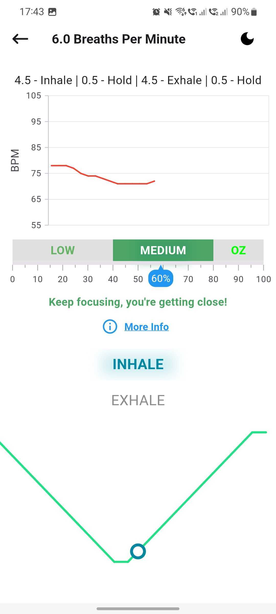

# Using the Optimal HRV app

Working with the [Optimal HRV Reader](https://www.optimalhrv.com/devices), our app provides a way to quantitatively measure Heart Rate Variability for yourself, for your employees, or for those you are caring for, as well as enhancing recovery with our in-app biofeedback training modules.

> **Important Notes** - Please read before using the Optimal HRV app:
>
> - To utilize the Optimal HRV app, you will need an HRV Reader. The application is suitable for all heart rate monitors that precisely gauge R-R intervals, possess Bluetooth 4.0 or ANT+, and allow external apps to connect.
> - While we highly recommend the Optimal HRV Reader, you can find a list of other compatible devices here.
> - Whatever device you decide to use should be your consistent device. Different devices may show different results and cannot be compared to one another.
> - Connect the Bluetooth reader through the app itself as you start to take a reading or do a training session. Do not connect through the Bluetooth menu on your phone.

## Quick Navigation - Find What You Need

This guide is organized by **use cases** to help you accomplish your goals quickly. Choose the section that matches what you want to do:

- **[Getting Started](#_1-getting-started)** - New to Optimal HRV? Set up your account, connect your device, and complete onboarding
- **[Daily HRV Tracking](#_2-daily-hrv-tracking)** - Learn how to take morning and anytime readings, add tags, and view your history
- **[Finding Your Resonance Frequency](#_3-finding-your-resonance-frequency)** - Complete the RF assessment to determine your ideal breathing rate
- **[Biofeedback Training](#_4-biofeedback-training)** - Improve your HRV through guided breathing exercises at your RF rate
- **[Mindfulness & Self-Compassion Practice](#_5-mindfulness-amp-self-compassion-practice)** - Practice mindfulness and self-compassion activities
- **[Understanding Your Data](#_6-understanding-your-data)** - Learn what your HRV metrics mean and how to interpret your results
- **[Customizing Your Experience](#_7-customizing-your-experience)** - Personalize settings, breathing parameters, and display preferences
- **[Settings & Support](#_8-settings-amp-support)** - Access app settings, manage your account, and get help with support features
- **[Troubleshooting & Support](#_9-troubleshooting-amp-support)** - Get help with connection issues, app updates, and technical problems
- **[Learning Resources](#_10-learning-resources)** - Access videos, podcasts, and educational content about HRV

---

## 1. Getting Started

_Use Case: "I'm new to Optimal HRV and want to set up my account and device"_

### Creating Your Account

You can create an Optimal HRV account in several ways:

- **Email and Password**: Click "Create Account" and sign up using your email address and a password
- **Apple ID**: Sign in with your Apple ID for quick access
- **Google Account**: Use your Google account for seamless login

> **Note**: Unless you received specific instructions from the Optimal Team or a professional you're working with, leave the "Organization" login information blank.

_For information about language selection, see [Language Selection](#language-selection) in the Settings & Support section._

### Setting Up Your Profile

The Profile page is essential to visit early in your HRV journey. Make sure to:

- Set your **date of birth** - Required for accurate population norm comparisons
- Set your **gender** - Required for accurate population norm comparisons
- Review your account settings

### Connecting Your HRV Device

Before you can take readings or start training sessions, you need to connect your HRV device. Follow these steps:

1. **Connect via the App Only**: Always connect your Bluetooth reader through the app, not through your phone's Bluetooth settings menu.

2. **Allow Permissions**: When starting a reading, the app will prompt you to grant Bluetooth and location permissions if not already enabled.

3. **Enable Bluetooth and Location Services**: If these services are off, the app will ask you to turn them on to proceed.

4. **Turn On and Wear Your HRV Reader**: Ensure your HRV reader is powered on and worn according to the device's instructions.

5. **Select Your Device**: The "Bluetooth Devices" screen will appear. Select your device to automatically start the reading.

6. **Reconnecting**: Note that when you close the app, the device disconnects automatically. You'll need to reconnect each time you reopen the app.

> **Having trouble connecting?** See the [Troubleshooting & Support](#_9-troubleshooting-amp-support) section for detailed help.

### Completing the Onboarding Process

We've created a **seven-day onboarding process** to help new users explore all the functions and benefits of the Optimal HRV app. This guided experience will:

- Introduce you to key features
- Help you take your first readings
- Guide you through your first biofeedback training
- Teach you about HRV and its importance
- Include video summary screens that provide visual overviews of key concepts and features

**Start here!** Look for the "Onboarding Tasks" section in the app menu to begin your 7-day journey. Throughout the onboarding process, you'll encounter video summary screens that help reinforce what you've learned.

### Setting Up Reminders

To help you remember to take your HRV readings and complete your daily tracking and training:

1. Go to **Profile** → **Reminders**
2. Set reminder alarms for:
   - Morning readings
   - Biofeedback training sessions
   - Mindfulness practice

**Related Topics**: [Daily HRV Tracking](#_2-daily-hrv-tracking) | [Settings & Support](#_8-settings-amp-support) | [Troubleshooting & Support](#_9-troubleshooting-amp-support)

---

## 2. Daily HRV Tracking

_Use Case: "I want to track my HRV daily to monitor my health"_

### Taking Morning Readings

Morning readings provide a **consistent baseline** for overall health and wellness. Here's how to take them:

1. **Prepare**: Place your Bluetooth device next to your phone, alarm clock, or another place that will remind you to take a morning reading
2. **Connect**: Follow the [device connection steps](#connecting-your-hrv-device) above
3. **Take the Reading**: The reading will automatically start once your device is connected
4. **During the Reading**:
   - You'll see a chart displaying your heart rate and a timer
   - **Breathe normally** - These readings give you a snapshot of how you're doing. Controlling your breath could change the results
   - **Keep your position consistent** - Your body position can influence your HRV. Sit comfortably during the reading and use this same position every time

Morning readings are typically **3 minutes long** (though you can adjust this in settings). The "Morning" tag will be automatically applied.

### Taking Anytime Readings

Anytime readings can be taken **anytime throughout the day** to:

- Track your HRV at different times
- Experiment with how specific activities, therapies, and events influence your HRV
- Compare pre and post-activity HRV changes

The process is the same as morning readings - connect your device and let the reading run. You can add tags to indicate what you were doing or how you were feeling.

### Adding Tags and Notes

After completing a Morning or Anytime Reading, you can add:

- **Tags**: Time of day, emotional state, events, and substances
- **Custom Tags**: Create your own tags to track specific patterns (see [Customizing Your Experience](#_7-customizing-your-experience))
- **Notes**: Add written notes about the reading

Tags help you identify patterns and understand what affects your HRV. Morning readings automatically include the "Morning" tag.

### Viewing Your Reading History

To see all your past readings:

1. After completing a reading, tap the **History** button at the bottom of the Results page
2. You'll see:
   - A chart showing all your readings over time
   - A list of past readings with details

**Reading Details Include**:

- RMSSD score
- Reading length
- Selected tags
- Notes
- Advanced metrics: Max-Min, SDNN, Low Frequency, High Frequency, and Very Low Frequency

### Understanding Low Quality Readings

Readings with insufficient data are marked as **"Low Quality Reading"**. This can happen if:

- The device connection was interrupted
- There was too much movement during the reading
- The sensor wasn't properly positioned

For more details about a low quality reading, tap on the "Low Quality" link in your reading history.

**Related Topics**: [Understanding Your Data](#_6-understanding-your-data) | [Customizing Your Experience](#_7-customizing-your-experience)

---

## 3. Finding Your Resonance Frequency

_Use Case: "I want to determine my ideal breathing rate for training"_

### What is Resonance Frequency (RF) Assessment?

The **Resonance Frequency Assessment** determines your ideal breathing rate - the rate that will optimize your breathing, mindfulness, and self-compassion training. This is **your personal optimal breathing rate**.

**Important Facts**:

- Your breathing rate does **not change after age 13**
- No rate is better than another - it's **YOUR best rate**
- You only need to take the assessment **once** (unless you're under 20, then repeat once per year)
- The assessment is appropriate for **ages 13 and up**

### When to Take the RF Assessment

- **First time users**: Take this before starting biofeedback training
- **Age 13-20**: Repeat once per year as your body develops
- **Age 20+**: Once is enough - your RF rate won't change

### Completing the RF Assessment

1. **Select Your Age Group**: The app will show you the most suitable assessment for your age
2. **Follow the Guide**: The assessment will guide you through multiple 2-minute breathing exercises
3. **Stay Focused**:
   - Ensure your sensor is attached for the duration
   - Limit your movement
   - Focus on the pacer
   - The assessment takes about 14 minutes (with pauses between different breathing rates)
4. **Get Your Results**: At the end, you'll see your ideal breathing rate (RF rate) that you'll use for all future biofeedback training

### Viewing Past RF Assessments

To review your past RF assessment results:

- Go to **Biofeedback & Mindfulness** → **Resonance Frequency Assessment** section
- Tap on **"Start Reading"**
- Then tap **"Your last biofeedback training rate"**
- You'll see the results of your last RF assessments

**Related Topics**: [Biofeedback Training](#_4-biofeedback-training) | [Understanding Your Data](#_6-understanding-your-data)

---

## 4. Biofeedback Training

_Use Case: "I want to improve my HRV through breathing exercises"_

### Starting a Biofeedback Training Session

Biofeedback training allows you to train your HRV at your Resonance Frequency (RF) breathing rate. To start:

1. **Complete RF Assessment First**: If you haven't already, complete the [Resonance Frequency Assessment](#_3-finding-your-resonance-frequency)
2. **Connect Your Device**: Follow the [device connection steps](#connecting-your-hrv-device)
3. **Choose Your Mode**:
   - **"Track HRV"**: Provides an EKG during training and HRV data at the conclusion
   - **"Show pacer only"**: Practice your RF breathing rate with just the pacer (no HRV tracking)

### Understanding the Optimal Zone Gauge

During your training session, you'll see the **Optimal Zone (OZ) Gauge** which shows how well you're matching your RF breathing rate:

- **Calculating Phase**: For the first minute, you'll see "Calculating your Optimal Zone"
- **Low (0-40)**: Focus on following the pacer closely
- **Medium (41-80)**: Keep it up, you're close to optimal
- **OZ (81-100)**: You've reached the optimal zone - excellent work!

The goal is to spend as much time as possible in the OZ range (81-100).

### Viewing Training Results

After completing a biofeedback training session, you'll see a results page with:

- HRV data collected during the training
- Session length
- Breaths Per Minute (BPM)
- Optimal Zone percentage
- Advanced metrics: RMSSD, Max-Min, SDNN, Low Frequency, High Frequency, Very Low Frequency

### Viewing Training History

To see all your past biofeedback training sessions:

- Go to **Biofeedback & Mindfulness** page
- In the "History" section, tap **"Your last biofeedback training rate"**
- You'll see a list of all your training sessions with details

**Related Topics**: [Finding Your Resonance Frequency](#_3-finding-your-resonance-frequency) | [Customizing Your Experience](#_7-customizing-your-experience) | [Understanding Your Data](#_6-understanding-your-data)

---

## 5. Mindfulness & Self-Compassion Practice

_Use Case: "I want to practice mindfulness and self-compassion at my RF rate"_

### Mindfulness Training

Optimal HRV provides a range of proven mindfulness training activities to practice at your Resonance Frequency breathing rate:

1. **Browse Activities**: Explore the available mindfulness activities to find your favorites
2. **Select an Activity**: Choose the mindfulness practice you want to try
3. **Choose Your Mode**:
   - **Track HRV**: Monitor your HRV during the practice
   - **Pacer Only**: Practice with just the breathing pacer (no HRV tracking)
4. **Follow the Guidance**: Each activity provides guided instructions for your practice

### Self-Compassion Training

There is extensive research demonstrating the positive benefits of self-compassion training. Optimal HRV worked with **Dr. Chris Germer** from the Center for Mindfulness and Compassion and **Harvard Medical School** to integrate best practices into the app.

Self-Compassion Training functions similarly to Mindfulness Training:

- Browse available self-compassion activities
- Select an activity
- Choose to track HRV or use pacer only
- Follow the guided practice

### Viewing Mindfulness & Self-Compassion History

To see all your past mindfulness and self-compassion sessions:

- Go to **Biofeedback & Mindfulness** page
- In the "History" section, tap **"Your last biofeedback training rate"**
- You'll see all your sessions listed with details including session length, BPM, Optimal Zone %, and HRV metrics

**Related Topics**: [Biofeedback Training](#_4-biofeedback-training) | [Finding Your Resonance Frequency](#_3-finding-your-resonance-frequency)

---

## 6. Understanding Your Data

_Use Case: "I want to understand what my HRV data means"_

### Understanding RMSSD

Optimal HRV uses **RMSSD** (Root Mean Square of the Successive Differences) for Morning and Anytime Readings. RMSSD is one of the best-researched HRV metrics to measure the resiliency and health of the nervous system.

**Key Point**: `The higher the HRV score, the better!`

### Reading Your Results Page

After completing a reading, you'll see several metrics:

#### Latest

The results of the reading you just completed or your most recent reading.

#### Previous

Your HRV score from the second most recent reading. This allows you to compare:

- **Pre-test**: Your Previous reading (before an activity)
- **Post-test**: Your Latest reading (after an activity)

Use this to see how activities (workouts, sleep, work, therapy, mindfulness) impact your HRV.

#### Last Week

An average of your HRV scores over the **last seven days**. This provides insight into how you're doing this week.

#### Last Month

An average of your HRV scores over the **last 30 days**. Compare this to your weekly and daily scores to see which direction your health is trending.

#### All Time

The average of **all your HRV scores**. This is your baseline for comparison.

**Goal**: Improve or maintain your All Time average over time. Ideally, your Last Week and Last Month averages should be above your All Time average.

#### Population

The average HRV score for your age and gender. This is provided **only for informational purposes**.

> **Important**: Many factors influence HRV, including genetics. `The goal is to improve and maintain your All Time Average over time and not worry about the population norms`.

### Advanced Metrics Explained

When viewing reading or training session details, you'll see additional metrics:

- **Max-Min**: The difference between maximum and minimum heart rate intervals
- **SDNN**: Standard Deviation of Normal-to-Normal intervals - measures overall HRV
- **Low Frequency (LF)**: Power in the low frequency band (0.04-0.15 Hz)
- **High Frequency (HF)**: Power in the high frequency band (0.15-0.4 Hz)
- **Very Low Frequency (VLF)**: Power in the very low frequency band (0.0033-0.04 Hz)

These metrics provide deeper insights into your autonomic nervous system function.

### Reading Your Dashboard

The dashboard shows:

- Your latest reading
- 7-day average trends
- Historical charts
- Comparison metrics

Use the dashboard to track your progress over time and identify patterns in your HRV.

**Related Topics**: [Daily HRV Tracking](#_2-daily-hrv-tracking) | [Learning Resources](#_10-learning-resources)

---

## 7. Customizing Your Experience

_Use Case: "I want to personalize the app to my preferences"_

The **Reading Settings** screen allows you to customize your app experience with a variety of options and configurations.

### HRV Reading Settings

#### RMSSD Reading Length

Adjust the length of time for which RMSSD is calculated. This allows you to fine-tune how sensitive your HRV readings are to fluctuations over different time periods.

#### Manage Custom Tags

Organize and manage your custom tags used to label and categorize your HRV sessions. This feature helps you track specific patterns or triggers that affect your HRV.

### Breathing Settings

Fine-tune your breathing parameters to optimize your training:

#### Inhale/Exhale Percentage

Adjust the inhale and exhale duration as a percentage of your breathing cycle to find a balance that works best for you.

#### Inhale Hold & Exhale Hold

Set optional hold durations after inhalation and exhalation to deepen your practice and improve breath control.

#### BPM Selection

Choose your target **Breaths Per Minute (BPM)** based on your personal preference or resonance frequency.

#### Default Breathing Rates

Your default breathing rates are auto-adjusted based on your age group. However, you can manually modify the list of breathing rates to better suit your needs.

### Biofeedback & Mindfulness Session Settings

Customize your biofeedback and mindfulness sessions:

#### Biofeedback Session Length

Set the duration of your biofeedback session to match your training preferences, whether it's a short focus session or a longer practice.

#### Show Oz Meter

Enable or disable the **Optimal Zone Meter**, which visually tracks your progress in real-time, helping you stay aware of your current zone.

#### Show Suggestions

Activate or deactivate real-time guidance suggestions to help you optimize your breathing and stay within the desired zone.

#### Sound & Vibration Cues

Adjust sound and vibration feedback to help you stay in rhythm during your practice without needing to look at the screen.

#### Pacer Sound

Customize the sounds for both inhalation and exhalation. You can choose from a list of **19 different sounds** that suit your preferences, helping you stay aligned with the pacer and making your sessions more enjoyable.

### Display Preferences

#### Dark Mode

Toggle Dark Mode to enable or disable dark mode within the app. Dark mode reduces eye strain in low-light environments and enhances visibility by providing a darker color palette throughout the interface.

#### Countdown Timer

Enable or disable the countdown timer before starting a session. The countdown timer provides a brief moment to prepare before your training begins, helping you transition into the practice smoothly.

#### Length of Countdown Timer

Adjust the length of the countdown timer to fit your preference. Whether you prefer a brief 3-second countdown or a longer 10-second period, this setting gives you control over how much preparation time you need before starting a session.

With these settings, you can create a personalized experience that fits your needs and enhances your overall HRV journey.

**Related Topics**: [Biofeedback Training](#_4-biofeedback-training) | [Mindfulness & Self-Compassion Practice](#_5-mindfulness-amp-self-compassion-practice)

---

## 8. Settings & Support

_Use Case: "I want to access app settings, manage my account, or get help"_

The **Settings & Support** screen is your central hub for managing app preferences, account settings, and accessing support features. You can access it by going to **Profile** → **Settings**.

### Accessing Settings & Support

To access the Settings & Support screen:

1. Tap the **Profile** tab at the bottom of the app
2. Tap **Settings** to open the Settings & Support screen

Here you'll find all configuration options, account management tools, and support resources in one convenient location.

### Language Selection

The Optimal HRV app supports **17+ languages** with automatic language detection based on your device settings. You can also manually select your preferred language:

1. Go to **Profile** → **Settings**
2. Select **Language** or **Language Preferences**
3. Choose your preferred language from the list
4. The app will update all text immediately

The app will remember your language preference for future sessions.

### Test Device Feature

The **Test Device** feature allows you to quickly diagnose connection issues with your HRV device. This is especially useful when you're experiencing persistent connection problems.

**How to Access:**

- Go to **Profile** → **Settings** → **Test Device**

**What It Does:**

- Tests your device's Bluetooth connectivity
- Verifies that your device is discoverable and can communicate with the app
- Checks for common connection issues
- Provides diagnostic information about your device's status

**When to Use:**

- When your device isn't appearing in the device list
- If you're experiencing frequent disconnections
- Before contacting support, to gather diagnostic information
- After updating the app or your device's firmware

**How to Interpret Results:**

- **Success**: Your device is working correctly and should connect normally
- **Connection Issues**: Follow the troubleshooting steps provided, or try restarting your device and phone
- **Device Not Found**: Ensure your device is powered on, in range, and not connected to another app
- **Error Messages**: Note any specific error messages to share with support if problems persist

### Support Logs

The **Support Logs** feature allows you to send diagnostic information directly to the Optimal HRV support team for faster issue resolution.

**How to Access:**

- Go to **Profile** → **Settings** → **Support Logs**

**How to Use:**

1. Tap **Support Logs** in the Settings screen
2. Describe the issue briefly, helping us understand what you were attempting in the app when the issue occurred
3. Provide details of any error messages you saw
4. Tap the **email icon** at the bottom right
5. This will open your default email app with diagnostic information pre-filled
6. Send the email to the support address provided

For detailed step-by-step instructions, see the [Support Logs guide](../Others/support.md).

### Account Management

Manage your account settings and information directly from the Settings screen:

#### Changing Account Information

Update your account details:

- Go to **Profile** → **Profile Details**
- Update your email, password, or profile information
- For organization accounts, contact your administrator for changes

#### Password Reset

If you've forgotten your password:

1. Go to the login screen
2. Tap **"Forgot Password"** or **"Reset Password"**
3. Enter your email address
4. Follow the instructions sent to your email

#### Account Deletion

You can delete your account directly from the app:

1. Go to **Profile** → **Settings**
2. Scroll to **Account Management** or **Delete Account**
3. Tap **Delete Account**
4. Confirm your decision (this action cannot be undone)
5. The app will:
   - Delete all your account data
   - Remove all your HRV readings and training history
   - Sign you out automatically

> **Warning**: Account deletion is permanent and cannot be undone. All your data will be permanently deleted.

### App Update Settings

The Optimal HRV app includes **automatic update checking**:

#### Update Notifications

- The app will notify you when updates are available
- Notifications appear when you open the app
- You can check for updates manually in your device's app store

#### Mandatory Updates

- Some app updates are **mandatory** and will block app usage until updated
- You'll see a clear message indicating the update is required
- Follow the prompts to update through your app store

#### Optional Updates

- Other updates are **optional** and can be skipped
- You'll see a notification about available updates
- You can choose to update now or later

### Additional Settings

The Settings screen also provides access to:

- **Reading Settings**: Customize HRV reading parameters (see [Customizing Your Experience](#_7-customizing-your-experience))
- **Breathing Settings**: Adjust breathing parameters and rates
- **Session Settings**: Configure biofeedback and mindfulness session preferences
- **Display Preferences**: Toggle dark mode, countdown timers, and other display options

**Related Topics**: [Customizing Your Experience](#_7-customizing-your-experience) | [Troubleshooting & Support](#_9-troubleshooting-amp-support) | [Getting Started](#_1-getting-started)

---

## 9. Troubleshooting & Support

_Use Case: "I'm having technical issues and need help resolving them"_

This section focuses on resolving technical problems and connection issues. For accessing settings and support features, see [Settings & Support](#_8-settings-amp-support).

### Device Connection Problems

If you're experiencing connection issues, follow these troubleshooting steps:

#### Basic Troubleshooting Steps

1. **Restart Everything**:

   - Close and reopen the Optimal HRV app
   - Turn your phone's Bluetooth off and back on
   - Power your HRV reader off and on
   - This simple reset often resolves most connection issues

2. **Disconnect from Bluetooth Settings**:

   - If your device is connected via the system's Bluetooth menu, disconnect or "forget" the device from there
   - Then try reconnecting through the app

3. **Check Other Apps**:

   - If your device is paired with another app, disconnect or "forget" it from there as well
   - Then try reconnecting

4. **Confirm Device Power & Sensor Placement**:

   - Ensure your device is powered on
   - Check that the sensor is properly positioned
   - When active, the device should blink with a blue or red light

5. **Refresh the Device List**:

   - Press the 🔄 refresh icon in the top-right corner of the device selection modal
   - Try refreshing two or three times

6. **Ensure Bluetooth and Location are On**:
   - Make sure both Bluetooth and Location are enabled on your device
   - Then try connecting again

#### Using the Troubleshooting Widget

If you're still having connection issues, the app now includes a **troubleshooting widget** that provides:

- Step-by-step guidance for common connection problems
- Direct access to support resources
- Quick tips for resolving Bluetooth issues

Access the troubleshooting widget through:

- **Morning HRV** → **New Reading** → On the devices sheet, scroll down and tap **"Don't see your device? Need Help?"**
- OR run a quick device test: **Settings** → **Test Device**

#### Test Device Feature

The **Test Device** feature allows you to quickly diagnose connection issues with your HRV device. This is especially useful when you're experiencing persistent connection problems.

**How to Access:**

- Go to **Settings** → **Test Device**

**What It Does:**

- Tests your device's Bluetooth connectivity
- Verifies that your device is discoverable and can communicate with the app
- Checks for common connection issues
- Provides diagnostic information about your device's status

**When to Use:**

- When your device isn't appearing in the device list
- If you're experiencing frequent disconnections
- Before contacting support, to gather diagnostic information
- After updating the app or your device's firmware

**How to Interpret Results:**

- **Success**: Your device is working correctly and should connect normally
- **Connection Issues**: Follow the troubleshooting steps provided, or try restarting your device and phone
- **Device Not Found**: Ensure your device is powered on, in range, and not connected to another app
- **Error Messages**: Note any specific error messages to share with support if problems persist

#### Still Having Issues?

If none of these steps resolve the issue, please reach out to us:

- **Email**: [support@optimalhrv.com](mailto:support@optimalhrv.com?subject=Problem%20connecting%20my%20device)
- Use the troubleshooting widget's "Contact Support" feature for direct help

### App Update Issues

For information about app updates, see [App Update Settings](#app-update-settings) in the Settings & Support section.

### Account Management

For account management features including password reset, account deletion, and changing account information, see [Account Management](#account-management) in the Settings & Support section.

### Low Quality Readings

If you're getting frequent low quality readings:

- Ensure your device is properly positioned and secure
- Minimize movement during readings
- Check that your device battery is charged
- Verify Bluetooth connection is stable
- Try a different reading location if interference is suspected

See [Understanding Your Data](#_6-understanding-your-data) for more information about low quality readings.

### Getting Additional Support

For additional help:

- **Email Support**: [support@optimalhrv.com](mailto:support@optimalhrv.com)
- **In-App Support**: Use the troubleshooting widget for guided help
- **Support Logs**: Send diagnostic logs to support for faster issue resolution. See [Support Logs](#support-logs) in Settings & Support or the [Support Logs guide](../Others/support.md) for detailed instructions
- **Settings & Support**: Access all support features through [Settings & Support](#_8-settings-amp-support)
- **Documentation**: Check other sections of this guide for detailed instructions

**Related Topics**: [Settings & Support](#_8-settings-amp-support) | [Getting Started](#_1-getting-started) | [Daily HRV Tracking](#_2-daily-hrv-tracking)

---

## 10. Learning Resources

_Use Case: "I want to learn more about HRV and how to use the app"_

### Educational Videos

We've created a series of videos to help you:

- Use the app effectively
- Understand HRV and its importance
- Learn strategies to utilize HRV to improve your health and well-being

Access videos through:

- **Resources & Tutorials** → **Videos**
- The onboarding process includes several educational videos
- The welcome screen includes an introductory video

### Heart Rate Variability Podcast

Access our **Heart Rate Variability Podcast** with over 100 episodes covering:

- The evolving science of HRV
- Research findings
- Practical applications of HRV

Find the podcast link in **Resources & Tutorials** → **Podcast**

### Data Definitions

Learn the meaning of terms used throughout the Optimal HRV app:

- Go to **Resources & Tutorials** → **Data Definitions**
- Browse definitions for all HRV metrics and app terminology

### Onboarding Tasks

The **7-day onboarding process** is designed to help you:

- Explore all app functions
- Take your first readings
- Complete your first biofeedback training
- Understand HRV fundamentals

Complete onboarding tasks to build your HRV knowledge step by step.

### Best Practices and Tips

Throughout your HRV journey, remember:

- **Consistency is key**: Take readings at the same time and in the same position
- **Use the same device**: Different devices may show different results
- **Track patterns**: Use tags and notes to identify what affects your HRV
- **Focus on trends**: Don't worry about individual readings - look at weekly and monthly trends
- **Practice regularly**: Biofeedback and mindfulness training improve with regular practice

**Related Topics**: [Getting Started](#_1-getting-started) | [Understanding Your Data](#_6-understanding-your-data)

---

## Quick Reference Links

- [Getting Started Guide](#_1-getting-started)
- [How to Take Readings](#_2-daily-hrv-tracking)
- [RF Assessment Guide](#_3-finding-your-resonance-frequency)
- [Biofeedback Training](#_4-biofeedback-training)
- [Settings & Customization](#_7-customizing-your-experience)
- [Settings & Support](#_8-settings-amp-support)
- [Troubleshooting Help](#_9-troubleshooting-amp-support)

---

_Last Updated: Based on app version 6.21.21+_
