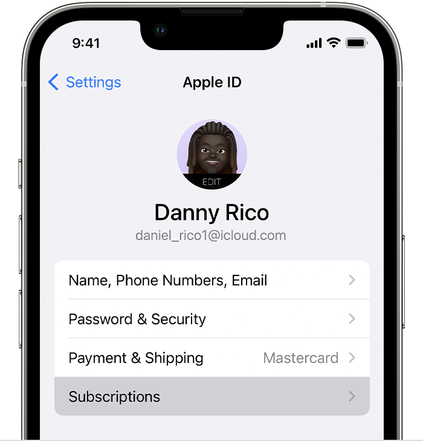

### Apple App Store - Cancel, Pause, or Change a Subscription

#### Cancel a Subscription

- **Important:** Uninstalling an app does not cancel its subscription.

**How to cancel a subscription on your iPhone or iPad:**

1. Open the Settings app.
2. Tap your name.
3. Tap Subscriptions.
   

    
    

4. Tap the subscription.
5. Tap Cancel Subscription. You may need to scroll down to find the Cancel Subscription button. If there is no Cancel button or you see an expiration message in red text, the subscription has already been cancelled.

### Google Play - Cancel, Pause, or Change a Subscription

**Note:** Subscriptions on Google Play are indefinite. Charges are made at the start of each billing cycle based on the subscription terms, such as weekly or annually.

#### Cancel a Subscription

- **Important:** Uninstalling an app does not cancel its subscription.

**Steps to Cancel on a Computer:**

1. On your computer, go to [subscriptions in Google Play](https://play.google.com/store/account/subscriptions).
2. For the subscription you want to cancel, click **Manage**. 
3. Click **Cancel subscription**.
4. Within the confirmation pop-up, select a reason.
5. Click **Continue**.

**Steps to Cancel on Android:**

1. On your Android device, go to [subscriptions in Google Play](https://play.google.com/store/account/subscriptions).
2. Select the subscription you want to cancel.
3. Tap **Cancel subscription**.
4. Follow the instructions.
   

For detailed steps and information, please visit the [Google Play Support Page](https://support.google.com/googleplay/answer/7018481).