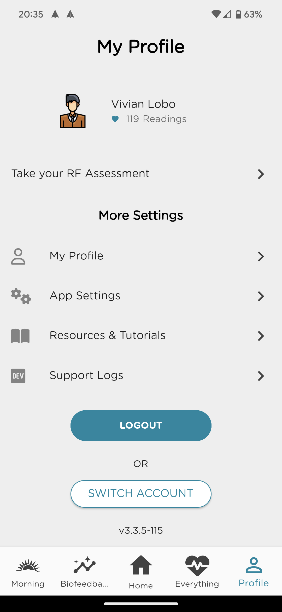
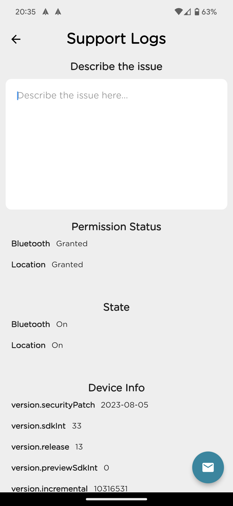
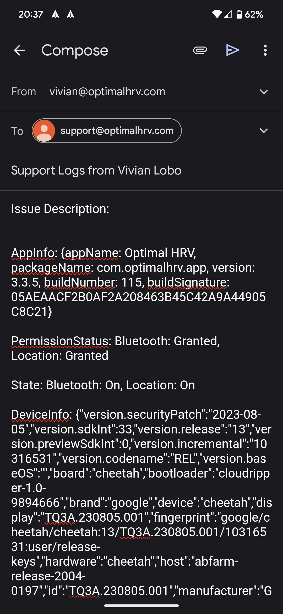

# How to send logs to support

- Click on **"Profile"** tab.
- Click on **"Support Logs"** option.
- Describe the issue briefly helping us understand what were you attempting in the app while the issue occured.
  - Do provide details of the error message you saw if any.
- Click on the **email floating icon** at the bottom right.
  - This should open your default email app OR may as you to select an email app.
  - The details would have been filled to help us diagnose any support issues. 
  - Send the email to the filled in support id. 

# Contact

Please do not hesitate to reach out to the Optimal Support Team: support@optimalhrv.com