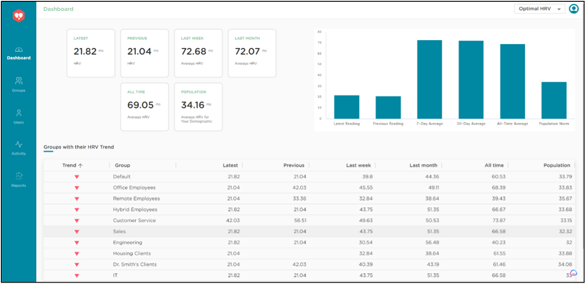
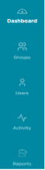
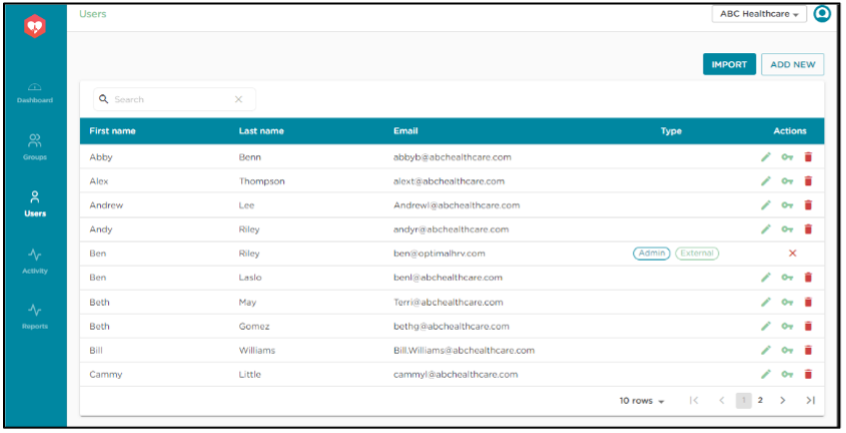
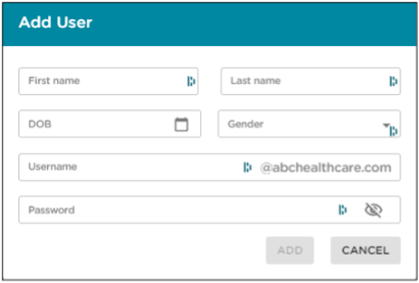
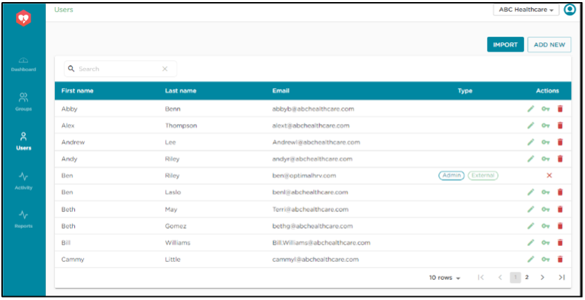
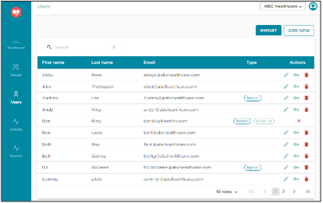
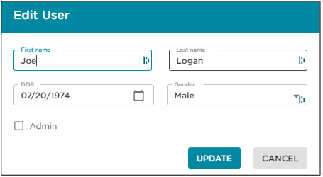
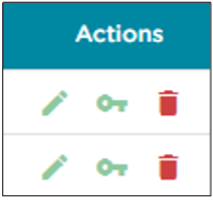

# Instructions - Optimal HRV Web Dashboard

The Optimal HRV Web Dashboard allows professionals, coaches, and managers to track an individual and group’s HRV and HRV training. Organizational owners get free access to the Optimal HRV app.

> Note : Only subscribed users get access

## Accessing the Web Dashboard

We provide two options for setting up a group and accessing the dashboard. Both options start with the owner setting up their group using this 'Organizational setup request' form. You can find the form [here](https://forms.wix.com/101291ad-5efa-411f-be67-bdc49fa9444a:e9bec8f2-9baa-45fc-a3d6-4c740d66f137).

- `Option 1`:
    - The organizational owner will then have their Users subscribe to the Optimal HRV app using their usual email account.
    - Users will then need to send an email from the associated email account to setup@optimalhrv.com telling us which organization should get access to their data. Please supply the organization's name and organizational owner (i.e., this may be the manager, coach, or clinician).
- `Option 2`:
    - The organizational owner signs users up directly through the Dashboard.
    - Optimal HRV will invoice the owner $4.99 per month per dashboard user.

You can log in to your dashboard once you have an organizational account. The link to the dashboard is found in the top right-hand corner at https://www.optimalhrv.com

The link will take you to the web dashboard login page. Once we set you up as an owner, the login information that gets you into the smartphone app will give you access to your dashboard.

<!-- 
 
You can log in to your dashboard once you have an organizational account. The link to the dashboard is found in the top right-hand corner at https://www.optimalhrv.com
 
 
 
 
 
 
 
 

The link will take you to the web dashboard login page. Once we set you up as an owner, the login information that gets you into the smartphone app will give you access to your dashboard. -->

## Organizational Dashboard Home Page

The first page you will see after login is the organizational dashboard. This page has two components. 
1. Collective information for everyone in your organization. 
2. A list of groups (that you create) and information from those groups. 

Notes: 
- Population norms for groups are figured by averaging the population information for everyone’s demographics in that group (gender and age).
- Unless you change it. The Default group contains all the people in your organization. 

You can click on a group to get information on the group and the individuals within that group.

The left menu bar:

    - Dashboard: Takes you back to the organizational dashboard
  
    - Groups: Links to a page with a list of groups and allows you to create new groups
  
    - Users: Links to a page with a list of individuals users and allows you to add new users
  
    - Activity: Links to a page where you can view recent activities on the web dash
  
    - Reports: Links to a data-rich page for detailed information on user HRV
  
 

## Adding New Users
- `Make sure you are on the main page, the organizational dashboard`.
- Click the user icon on the left menu. 
- A box will allow you to set up a new user. 
- If you do not know someone’s date of birth or gender, enter today’s date and Others for gender.
- Usernames set up through the web dash look like email addresses (whether that address exists or not). Consider this a unique username for login purposes.   
- Set a password.
- When you send people their username and password, encourage them to visit the Profile page the first time this log into the app. They should update their date of birth, gender, and new password.
- If you add many new users, email setup@optimalhrv.com to get an Excel spreadsheet to import many new users into your organization efficiently.

## Action Buttons on User Page
Additional functionality “Actions” on the far right of the user menu: 
- The trash can icon next to a user to delete them as a user. 
- The key icon will allow you to reset someone’s password. 
- Adding an admin user
  - Admin users can add new users and groups. They can also view user and group HRV data. 
  - If you add a new user manually, you will have the option to check the admin box, making them an administrator for the organization. 
- If you want to turn an existing non-admin user into an admin, click the pencil icon, and the edit user screen allows you to set them as an admin.

## Groups Page