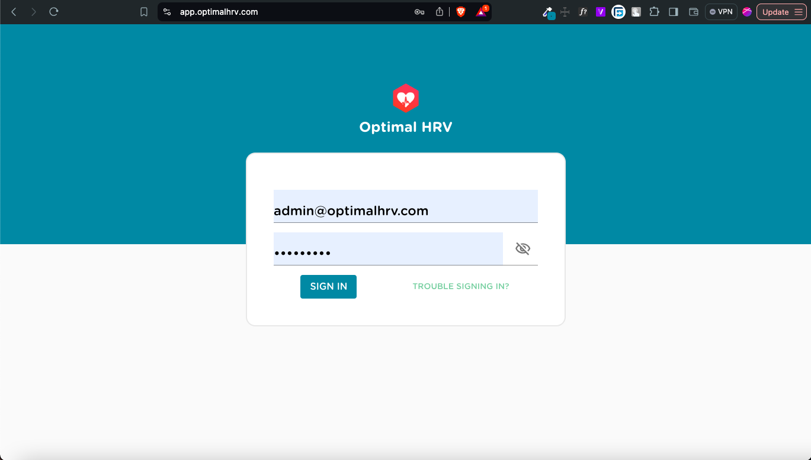
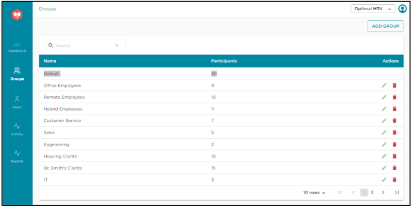
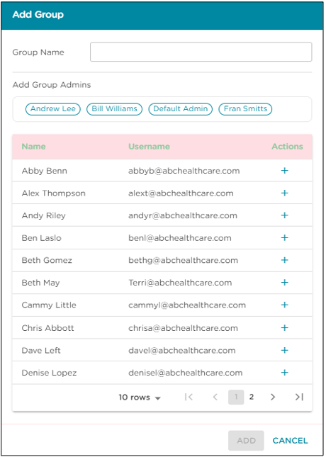

# Instructions - Optimal HRV Web Dashboard

The Optimal HRV Web Dashboard allows professionals, coaches, and managers to track an individual and group’s HRV and HRV training. Organizational owners get free access to the Optimal HRV app.

> Note : Only subscribed users get access

## Accessing the Web Dashboard

We provide two options for setting up a group and accessing the dashboard. Both options start with the owner setting up their group using this 'Organizational setup request' form. You can find the form [here](https://forms.wix.com/101291ad-5efa-411f-be67-bdc49fa9444a:e9bec8f2-9baa-45fc-a3d6-4c740d66f137).

- `Option 1`:
  - The organizational owner will then have their Users subscribe to the Optimal HRV app using their usual email account.
  - Users will then need to send an email from the associated email account to setup@optimalhrv.com telling us which organization should get access to their data. Please supply the organization's name and organizational owner (i.e., this may be the manager, coach, or clinician).
- `Option 2`:
  - The organizational owner signs users up directly through the Dashboard.
  - Optimal HRV will invoice the owner $4.99 per month per dashboard user.

You can log in to your dashboard once you have an organizational account. The link to the dashboard is found in the top right-hand corner at https://www.optimalhrv.com

The link will take you to the web dashboard login page. Once we set you up as an owner, the login information that gets you into the smartphone app will give you access to your dashboard.

<!-- 
 
You can log in to your dashboard once you have an organizational account. The link to the dashboard is found in the top right-hand corner at https://www.optimalhrv.com
 
 
 
 
 
 
 
 

The link will take you to the web dashboard login page. Once we set you up as an owner, the login information that gets you into the smartphone app will give you access to your dashboard. -->

## Organizational Dashboard Home Page

The first page you will see after login is the organizational dashboard. This page has two components.

1. Collective information for everyone in your organization.
2. A list of groups (that you create) and information from those groups.

Notes:

- Population norms for groups are figured by averaging the population information for everyone’s demographics in that group (gender and age).
- Unless you change it. The Default group contains all the people in your organization.

You can click on a group to get information on the group and the individuals within that group.

The left menu bar:

    - Dashboard: Takes you back to the organizational dashboard

    - Groups: Links to a page with a list of groups and allows you to create new groups

    - Users: Links to a page with a list of individuals users and allows you to add new users

    - Activity: Links to a page where you can view recent activities on the web dash

    - Reports: Links to a data-rich page for detailed information on user HRV

 

## Adding New Users

- `Make sure you are on the main page, the organizational dashboard`.
- Click the user icon on the left menu.
- A box will allow you to set up a new user.
- If you do not know someone’s date of birth or gender, enter today’s date and Others for gender.
- Usernames set up through the web dash look like email addresses (whether that address exists or not). Consider this a unique username for login purposes.
- Set a password.
- When you send people their username and password, encourage them to visit the Profile page the first time this log into the app. They should update their date of birth, gender, and new password.
- If you add many new users, email setup@optimalhrv.com to get an Excel spreadsheet to import many new users into your organization efficiently.

## Action Buttons on User Page

Additional functionality “Actions” on the far right of the user menu:

- The trash can icon next to a user to delete them as a user.
- The key icon will allow you to reset someone’s password.
- Adding an admin user
  - Admin users can add new users and groups. They can also view user and group HRV data.
  - If you add a new user manually, you will have the option to check the admin box, making them an administrator for the organization.
- If you want to turn an existing non-admin user into an admin, click the pencil icon, and the edit user screen allows you to set them as an admin.

## Groups Page

To access the Groups Page. Click the Groups icon on the left menu.

To add a new group and admin.

- Click the group icon on the left menu.
- A box will allow you to set up a new group.
- Name the group.
- Organizational admins are automatically set as admins for every group. As admins, they can view the group’s data and add users. However, their data will not be included unless they are added to the group.
- You can add group admins when creating a new group by clicking the plus icon next to their names. Adding someone as a group admin will allow them to add and remove people from a specific group and see that group’s information.

## To add people to a group

- Get to the group page:

  - Click the group icon on the left menu or click a group name on the dashboard.
  - This will link to the group home page with a list of users and HRV data for the individual and the group.
  - Clicking the User icon on the left menu will take you to a list of group members.
  - Click the Add User button.
  

  
  
  

- An Add User table will pop up.
  - Start typing the person’s name you want to add.
  - People whose name starts with that letter will automatically populate a drop-down menu.
  - Once you click the person’s name, they are added to the group. You can continue to add

## Reviewing People's HRV Data

- There are two pages to review user HRV data. The first is a general overview of HRV readings. The second is a more detailed view of HRV readings and trainings sessions.
- To access the general view. Go to the group page and click on the name of the person you want to review.
- The page contains information on individual readings and a person’s averages.
- You can access more information on people’s HRV data by clicking the reports icon on the left-hand menu, only visible from the main organization page.
  - On the reports page there is a drop-down menu labeled Users. This will give you a list of people in the organization.
  - Select the person or people you want to get data on and click the “Apply” button.
  - There is another drop-down menu labeled Tags. This menu allows you to view readings the user tags after their reading.

To further customize the data, four additional functions are on the Reports page.

- The first is a slider bar at the bottom of the charts that allow you to adjust the timeframe of the data displayed.

- The second is a date range. That also helps adjust the date range for the data display.

- The third is a gear icon next to the date range which opens a pop-up that allows you to choose to further customize the data with two drop-down menus:
  - The left menu lets you further customize the data by the time of day the reading is taken.
  

  
  

  - The right menu allows you to choose whether each reading is displayed separately or if you want an average of daily readings, for example. If a person takes three readings in a day, “District” will show each reading as individual data points. “Average” will show the average of those three readings.
  

  
  
  

  - Finally, there is a “Download Daily Readings” link. Clicking this link with create an Xcel Spreadsheet with data from all an user’s HRV readings.
- Fourth, you can select the specific HRV algorithms you want to view. While we provide RMSSD on the app for HRV readings. The app also collects the time domain data for Min-Max and SDNN. You can add or eliminate algorithms by clicking the algorithm’s name at the bottom of the chart.
  

  
  

- The app also collects Frequency Domain HRV algorithms as well including low-frequency, high-frequency, and very low-frequency. As with the time domain chart, you can click on the name at the bottom of the chart to add or remove algorithms.
  

  
  

- Finally, there is a “Download Daily Readings” link. Clicking this link creates an Xcel Spreadsheet with data from all the user’s HRV readings.
  

  
  

### Biofeedback and Mindfulness Page

- The Biofeedback and Mindfulness data are presented in a similar way to the Daily readings with a few additional functions.
  - The first is that you will see time in Optimal Zone on the left. Optimal HRV uses Optimal Zone as a simple metric to help users know when their training helps improve their HRV.
  - The frequency domains are on top of these pages, as breathing exercises are the best measures of HRV during training.
- The app also collects Frequency Domain HRV algorithms, including low-frequency, high-frequency, and very low-frequency. As with the time domain chart, you can click on the name at the bottom of the chart to add or remove algorithms.

