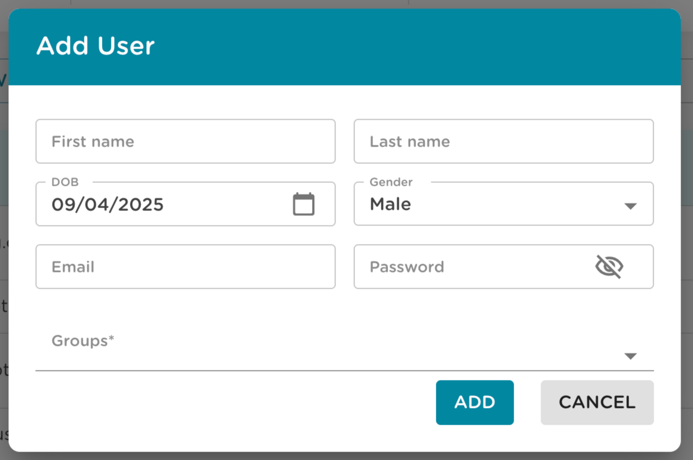
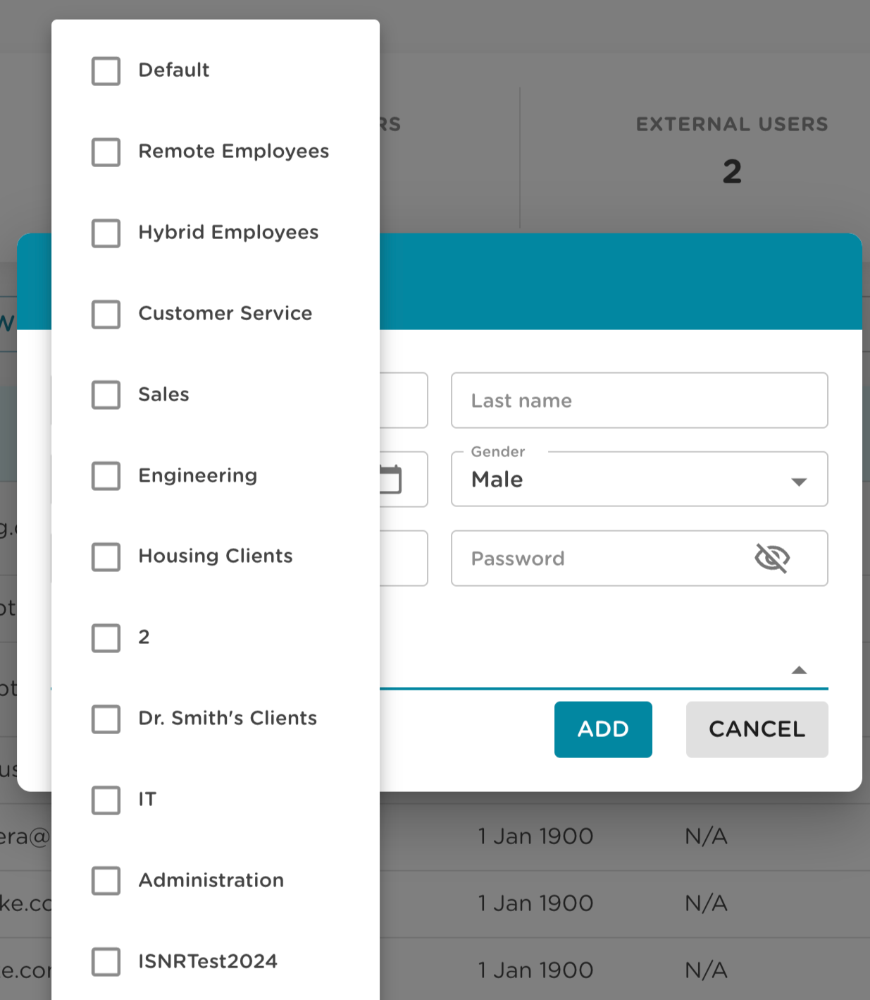

# Instructions - Optimal HRV Web Dashboard

The Optimal HRV Web Dashboard allows professionals, coaches, and managers to track an individual and group’s HRV and HRV training. Organizational owners get free access to the Optimal HRV app.

> Note : Only subscribed users get access

## Accessing the Web Dashboard

We provide two options for setting up a group and accessing the dashboard. Both options start with the owner setting up their group using this 'Organizational setup request' form. You can find the form [here](https://forms.wix.com/101291ad-5efa-411f-be67-bdc49fa9444a:e9bec8f2-9baa-45fc-a3d6-4c740d66f137).

- `Option 1`:
  - The organizational owner will then have their Users subscribe to the Optimal HRV app using their usual email account.
  - Users will then need to send an email from the associated email account to support@optimalhrv.com telling us which organization should get access to their data. Please supply the organization's name and organizational owner (i.e., this may be the manager, coach, or clinician).
- `Option 2`:
  - The organizational owner signs users up directly through the Dashboard.
  - Optimal HRV will invoice the owner $4.99 per month per dashboard user.

You can log in to your dashboard once you have an organizational account. The link to the dashboard is found in the top right-hand corner at https://www.optimalhrv.com

The link will take you to the web dashboard login page. Once we set you up as an owner, the login information that gets you into the smartphone app will give you access to your dashboard.

<!-- 
 
You can log in to your dashboard once you have an organizational account. The link to the dashboard is found in the top right-hand corner at https://www.optimalhrv.com
 
 
 
 
 
 
 
 

The link will take you to the web dashboard login page. Once we set you up as an owner, the login information that gets you into the smartphone app will give you access to your dashboard. -->

## Organizational Dashboard Home Page

The first page you will see after login is the organizational dashboard. This page has two components.

1. Collective information for everyone in your organization.
2. A list of groups (that you create) and information from those groups.

Notes:

- Population norms for groups are figured by averaging the population information for everyone’s demographics in that group (gender and age).
- Unless you change it. The Default group contains all the people in your organization.

You can click on a group to get information on the group and the individuals within that group.

The left menu bar:

    - Dashboard: Takes you back to the organizational dashboard

    - Groups: Links to a page with a list of groups and allows you to create new groups

    - Users: Links to a page with a list of individuals users and allows you to add new users

    - Invite Users: Links to a page where you can invite new users to the platform

    - Reports: Links to a data-rich page for detailed information on user HRV

 

## Creating New Users

Follow the steps below to manually add new users through the Organizational Dashboard:

1. **Navigate to the Dashboard**  
   Ensure you are on the main page of the Organizational Dashboard.

2. **Open the Users Page**  
   Click the **Users** icon from the left-hand menu.

3. **Add a New User**  
   Click the **Add User** button to open the user setup form.

4. **Fill in User Details**

   - **Name**: Enter the full name of the user.
   - **Username**: Create a username that resembles an email address. It does not need to be a real email — it is used as a unique login identifier.
   - **Password**: Set a secure temporary password for the user.
   - **Date of Birth**: If unknown, enter today’s date as a placeholder.
   - **Gender**: If unknown, select `Other`.

5. **Assign User to Groups (Optional)**  
   Now assign users to specific groups. Group admins have access to manage users within their groups and view corresponding HRV data.

6. **Communicate Login Credentials**  
   Share the username and password with the user securely.  
   Instruct the user to:
   - Log in using the provided credentials.
   - Visit their **Profile** page in the app.
   - Update their date of birth, gender, and change their password.

---

**Bulk User Import**

If you're adding a large number of users:

- Email [support@optimalhrv.com](mailto:support@optimalhrv.com) and request an Excel import template.
- Fill out the required fields in the spreadsheet and send it back for batch upload.

---

**Notes**

- Each user must have a unique username.
- The date of birth and gender are used to calculate population norms for HRV comparisons.
- Users can be added to groups later from the **Groups** section.

---

**Troubleshooting: Email Already Exists**

If you receive an error indicating the username or email already exists, it means the user is already registered in the Optimal HRV system.  
Due to security and privacy reasons, organizational admins **cannot directly add users who already have an account**.  
Instead, use the **Invite User** page to send them an invitation. If the user accepts the invite, you will gain access to their HRV data through your organization.

## Action Buttons on the Users Page

On the far right of each row in the Users list, you'll find **Action buttons** that allow you to manage individual users:

- **Delete a User**  
  Click the **trash can icon** to permanently remove a user from the organization.

- **Edit User Details / Set Admin Permissions**  
  Click the **pencil icon** to open the **Edit User** screen, where you can:

  - Update user information (name, username, etc.).
  - Grant **admin access** to the user by checking the **Admin** box.

  > Admin users have the ability to:
  >
  > - Add and manage users and groups
  > - View HRV data across all users and groups in the organization

## Inviting Existing Users

You can invite users to join your organization instead of adding them manually.

1. **Open the Invite Users Page**  
   From the Organizational Dashboard, navigate to the **Invite Users** page in the left-hand menu.

2. **Click the Invite User Button**  
   At the top of the page, click the **Invite User** button. This opens a dialog with the following fields:

   - **First Name**: Enter the user’s first name.
   - **Last Name**: Enter the user’s last name.
   - **Group**: Select the group you want this user to join.
   - **Email**: Enter the user’s existing email address (must match the one they used to register).
   - **Role**: Choose the user’s role within your organization using one of the following radio buttons:
     - **Organization Admin**
     - **Group Admin**
     - **User**

3. **Send the Invite**  
   Click the **Send Invite** button in the dialog. This sends an email with a secure link inviting the user to join your organization.

When the user clicks the link:

- They are redirected to the login screen.
- They can log in using their existing account or create a new one.
- Once logged in, they will be added to your organization with the selected role and group access.

---

**Invited Users Table**

A table listing all invited users along with their current status:

- **Pending**: The user has not yet accepted the invitation.
- **Accepted**: The user has accepted the invitation and is now part of your organization.

You can monitor and manage invitations from this table at any time.

## Groups Page

The Groups Page allows organization admins to create and manage groups, assign group admins, and control group-level access to HRV data.

**Accessing the Groups Page**

- Click the **Groups** icon in the left-hand menu of the Organizational Dashboard.

---

**Creating a New Group**

To add a new group and assign admins:

1. Click the **Add Group** button to open the add group dialog.
2. Enter the **Group Name**.
3. Select one or more users to be **Group Admins** by clicking on their names.
4. Select one or more users to be **Group Members** by clicking the plus icon next to their emails.

> **Note:**
>
> - **Organization Admins** are automatically set as admins for every group. They can view all group data and add users. However, they are not included in group HRV reports unless explicitly added to the group as a member.

---

**Managing Existing Groups**

Each group is displayed in a table with relevant actions, including an **Edit** button.

**Edit Group**

Click the **Edit** (pencil) icon next to a group to open the group management screen. This screen includes:

- **Group Name Header**  
  The current name of the group appears at the top with an **Update** button that allows renaming the group.

- **Group Admins Table**  
  Below the group name, you’ll see a table listing the current group admins. This table includes:
  - The name and email of each admin.
  - A **Delete** icon for removing an admin from the group.
  - An **Add Admin** button at the top of the table to assign new group admins.

Use this screen to efficiently manage admin access for each group.

## Switching Organizations or Groups

At the top bar of any page in the Organizational Dashboard, you'll find a dropdown displaying the **current organization or group name**.

**How It Works**

- This dropdown allows users with the appropriate permissions to switch between different organizations or groups.
- If the user is an **Organization Admin**, clicking the dropdown will reveal a list of all organizations and groups they have access to.
- Selecting a different organization or group from the list will update the dashboard view to reflect the selected context.

This feature is especially helpful for admins managing multiple groups or organizations under a single account.

## Lifetime Membership

Optimal HRV offers a **Lifetime Membership** that can be purchased directly from our official website: [www.optimalhrv.com](https://www.optimalhrv.com).

**Available Options**

We offer two types of lifetime membership plans:

1. **Lifetime Membership Only**  
   Grants full access to the Optimal HRV platform for life.

2. **Lifetime Membership + Optimal HRV Reader**  
   Includes lifetime platform access along with our official HRV reader device, shipped to your address.

**How to Purchase**

1. Visit [www.optimalhrv.com](https://www.optimalhrv.com).
2. Scroll down to the **Best Sellers** section and select the lifetime membership option that suits your needs.
3. Click the **Buy Now** button.
4. Fill in your **Customer Details**.  
   If you’re purchasing the membership with an HRV Reader, also complete the **Delivery Details** section.
5. Click **Continue** to proceed.
6. Select your preferred **Payment Method** and complete the checkout process.

**After Purchase**

Once your payment is successfully completed:

- You will receive a **confirmation email** with purchase details.
- If you ordered an HRV Reader, the email will include tracking information for your shipment.

This process ensures a smooth and secure way to gain permanent access to Optimal HRV’s platform and tools.

<!-- ## To add people to a group

- Get to the group page:

  - Click the group icon on the left menu or click a group name on the dashboard.
  - This will link to the group home page with a list of users and HRV data for the individual and the group.
  - Clicking the User icon on the left menu will take you to a list of group members.
  - Click the Add User button.
  

  
  
  

- An Add User table will pop up.
  - Start typing the person’s name you want to add.
  - People whose name starts with that letter will automatically populate a drop-down menu.
  - Once you click the person’s name, they are added to the group. You can continue to add

 -->

## Reviewing People's HRV Data

- There are two pages to review user HRV data. The first is a general overview of HRV readings. The second is a more detailed view of HRV readings and trainings sessions.
- To access the general view. Go to the group page and click on the name of the person you want to review.
- The page contains information on individual readings and a person’s averages.
- You can access more information on people’s HRV data by clicking the reports icon on the left-hand menu, only visible from the main organization page.
  - On the reports page there is a drop-down menu labeled Users. This will give you a list of people in the organization.
  - Select the person or people you want to get data on and click the “Apply” button.
  - There is another drop-down menu labeled Tags. This menu allows you to view readings the user tags after their reading.

To further customize the data, four additional functions are on the Reports page.

- The first is a slider bar at the bottom of the charts that allow you to adjust the timeframe of the data displayed.

- The second is a date range. That also helps adjust the date range for the data display.

- The third is a gear icon next to the date range which opens a pop-up that allows you to choose to further customize the data with two drop-down menus:
  - The left menu lets you further customize the data by the time of day the reading is taken.
  

  
  

  - The right menu allows you to choose whether each reading is displayed separately or if you want an average of daily readings, for example. If a person takes three readings in a day, “District” will show each reading as individual data points. “Average” will show the average of those three readings.
  

  
  
  

  - Finally, there is a “Download Daily Readings” link. Clicking this link with create an Xcel Spreadsheet with data from all an user’s HRV readings.
- Fourth, you can select the specific HRV algorithms you want to view. While we provide RMSSD on the app for HRV readings. The app also collects the time domain data for Min-Max and SDNN. You can add or eliminate algorithms by clicking the algorithm’s name at the bottom of the chart.
  

  
  

- The app also collects Frequency Domain HRV algorithms as well including low-frequency, high-frequency, and very low-frequency. As with the time domain chart, you can click on the name at the bottom of the chart to add or remove algorithms.
  

  
  

- Finally, there is a “Download Daily Readings” link. Clicking this link creates an Xcel Spreadsheet with data from all the user’s HRV readings.
  

  
  

### Biofeedback and Mindfulness Page

- The Biofeedback and Mindfulness data are presented in a similar way to the Daily readings with a few additional functions.
  - The first is that you will see time in Optimal Zone on the left. Optimal HRV uses Optimal Zone as a simple metric to help users know when their training helps improve their HRV.
  - The frequency domains are on top of these pages, as breathing exercises are the best measures of HRV during training.
- The app also collects Frequency Domain HRV algorithms, including low-frequency, high-frequency, and very low-frequency. As with the time domain chart, you can click on the name at the bottom of the chart to add or remove algorithms.

