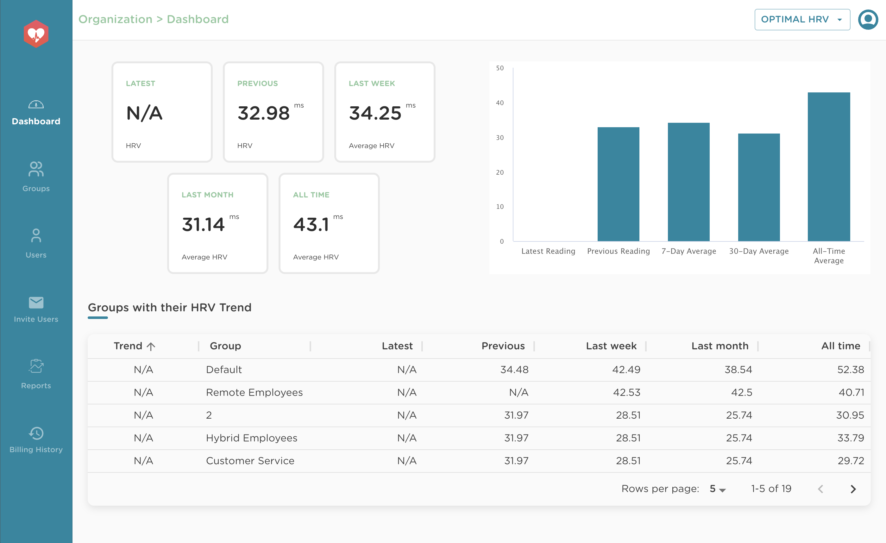
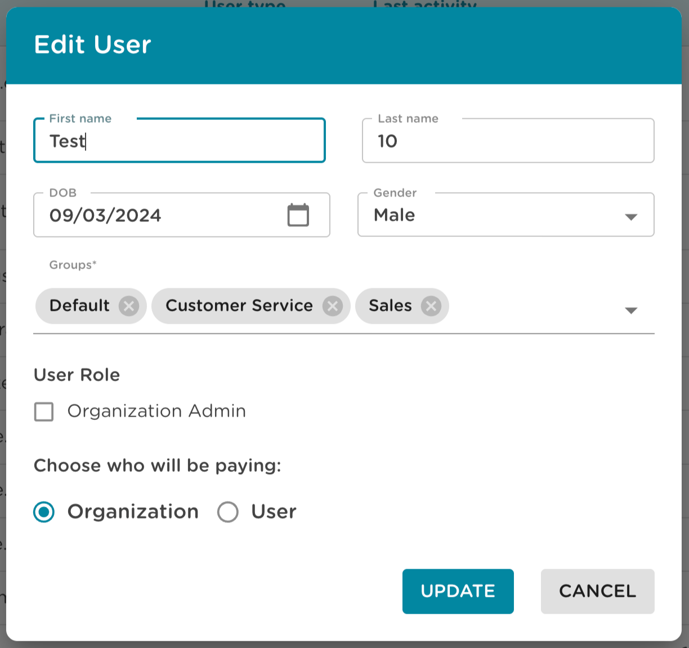

# Optimal HRV Web Dashboard Documentation

The Optimal HRV Web Dashboard allows professionals, coaches, and managers to track individual and group HRV and HRV training. Organizational owners get free access to the Optimal HRV app.

> **Note:** Only subscribed users get access to the web dashboard.

---

## 🏢 1: Getting Started

### Setting Up an Organization

**Target Audience:** Organizational Owners (typically **Organization Admins**)

#### Submit Setup Form

1. **Access the Form:** Use the [Organizational Setup Request Form](https://forms.wix.com/101291ad-5efa-411f-be67-bdc49fa9444a:e9bec8f2-9baa-45fc-a3d6-4c740d66f137)
2. **Complete Submission:** Fill out all required organizational details
3. **Wait for Setup:** Our team will process your request and set up your organizational account

#### Choose Setup Option

We provide two options for setting up a group and accessing the dashboard:

**Option 1: Independent User Subscription**

- Users subscribe to the Optimal HRV app using their usual email account
- Users email `support@optimalhrv.com` to link their account to your organization
- Include organization name and organizational owner details

**Option 2: Direct User Management** ⭐ **Recommended**

- Organizational owner signs up users directly through the Dashboard
- Optimal HRV invoices the owner **$4.99 per month per dashboard user**
- Full control over user management and billing

#### Log In to Dashboard

1. **Access Dashboard:** Visit [www.optimalhrv.com](https://www.optimalhrv.com) and click the dashboard link in the top-right corner

2. **Login Credentials:** Use the same login information that gets you into the smartphone app

#### Explore Dashboard

The **Organizational Dashboard Home Page** contains:

- **Collective Information:** Overview data for everyone in your organization
- **Group Management:** List of groups (that you create) with group-specific information
- **Default Group:** Contains all people in your organization unless modified
- **Population Norms:** Calculated by averaging demographics (gender and age) for each group

#### Navigate the Interface

**Left Menu Bar:**

    - Dashboard: Returns to the organizational dashboard

    - Groups: Manage groups and create new groups

    - Users: View and manage individual users

    - Invite Users: Send invitations to existing users

    - Reports: Access detailed HRV data analysis

    - Billing History: View all invoices and billing records

 

**Top-Right Dropdown:** Switch between organizations or groups (see [Switching Organizations or Groups](#switching-organizations-or-groups))

#### Role Clarification

**🏢 Organization Admins:**

- Full access to all groups, users, billing, and settings
- Can manage multiple groups and organizations
- Automatic admin access to every group

**👤 Group Admins:**

- Limited to managing users and data within assigned groups
- Cannot access billing or organization-wide settings
- Cannot create new groups

---

## 👥 2: Managing Users

**Target Audience:** **Organization Admins** (manage all users across organization) and **Group Admins** (manage users within assigned groups only)

### Users Management Page Overview

The **Users Management Page** is your central hub for all user-related tasks. Access it via the **Users** icon in the left-hand menu.

**Key Features:**

- **User Summary Metrics:** Active, Internal, External, and Total Users
- **Searchable/Sortable Table:** Find users quickly by name, email, or other attributes
- **Global Actions:** Import users in bulk or add new users individually

### Adding New Users

#### Manual User Creation

**For Organization Admins:**

1. **Navigate to Users Page:** Click the **Users** icon from the left-hand menu
2. **Add New User:** Click **"Add User"** or **"+ Add New"** button (UI may vary)
3. **Fill User Details:**
   - **Name:** Enter the full name of the user
   - **Username:** Create a username (resembles email address, used as unique login identifier)
   - **Password:** Set a secure temporary password
   - **Date of Birth:** If unknown, enter today's date as placeholder
   - **Gender:** If unknown, select "Other"
4. **Assign to Groups (Optional):** Select one or more groups during creation
5. **Submit:** Click **Submit** to create the user account

**For Group Admins:**

1. **Switch to Group Dashboard:** Use the top-right dropdown to switch to your group
2. **Follow Steps Above:** Same process as Organization Admins, but limited to your group

#### Bulk User Import

For large-scale user additions:

1. **Request Template:** Email `support@optimalhrv.com` requesting an Excel import template
2. **Complete Spreadsheet:** Fill out required fields in the provided template
3. **Submit for Upload:** Send the completed spreadsheet back for batch processing

#### Share Credentials Securely

After creating user accounts:

1. **Communicate Credentials:** Share username and password securely with the user
2. **Instruct User Actions:**
   - Log in using provided credentials
   - Visit their **Profile** page in the app
   - Update their date of birth, gender, and change their password

#### Troubleshooting: Email Already Exists

If you receive an error indicating the username or email already exists:

- **Use Invite Users:** The user is already registered in the Optimal HRV system
- **Security Note:** Organizational admins cannot directly add existing users due to privacy reasons
- **Solution:** Use the **Invite Users** page to send them an invitation (see [Inviting Existing Users](#inviting-existing-users))

### Assigning Existing Users to Groups

**Addresses Common Issue:** Users not appearing in group data

#### Step-by-Step Process

1. **Access Users Page:** From the Organizational Dashboard, click the **Users** icon
2. **Locate User:** Find the user in the list (use search if needed)
3. **Edit User:** Click the **pencil icon** (edit button) on the far right of their row
4. **Select Groups:** In the popup, find the **Groups dropdown** and select one or more groups
5. **Save Changes:** Click **Update** or **Save**
6. **Verify Assignment:** Go to the group's page and confirm the user appears

#### Important Notes

- **Organization Admins:** May need to switch to group dashboard for group-specific actions (future update planned)
- **Data Visibility:** Users must be in a group to see their HRV data
- **Verification:** Check that user appears in group and HRV data is visible

### Inviting Existing Users

Instead of manually adding users, you can invite existing Optimal HRV users to join your organization.

#### Send Invitation

1. **Access Invite Users Page:** Navigate to **Invite Users** in the left-hand menu
2. **Click Invite User:** Click the **Invite User** button at the top of the page
3. **Fill Invitation Details:**
   - **First Name & Last Name:** User's full name
   - **Group:** Select the group for this user
   - **Email:** Enter the user's existing email address (must match their registration)
   - **Role:** Choose user role:
     - **Organization Admin**
     - **Group Admin**
     - **User**
4. **Send Invite:** Click **Send Invite** to send an email with a secure link

#### Monitor Invitations

**Invited Users Table** shows all invitations with status:

- **Pending:** User hasn't accepted the invitation
- **Accepted:** User has joined your organization

#### User Acceptance Process

When users click the invitation link:

1. **Redirect to Login:** They're taken to the login screen
2. **Log In:** They use their existing account credentials
3. **Join Organization:** They're automatically added to your organization with the selected role and group access

### Managing Permissions

#### Grant/Revoke Roles

1. **Edit User:** Click the **pencil icon** next to any user
2. **Update Permissions:** In the **Access & Permissions** section:
   - **Groups:** Assign user to one or more groups (required)
   - **User Role:** Check **Organization Admin** box to grant admin privileges
3. **Save Changes:** Click **Update**

> **⚠️ Admin Capabilities:** Organization Admins can:
>
> - Add, edit, and manage all users and groups
> - Access sensitive data across all users and groups
> - Manage organization-wide settings and billing

#### Update Billing Configuration

In the **Billing Configuration** section:

- **Organization:** Company's central billing account pays for this user
- **User:** Individual user is billed directly

#### Delete Users

**⚠️ Warning:** This action is typically irreversible

1. **Locate User:** Find the user in the Users list
2. **Delete:** Click the **trash can icon** on the far right of their row
3. **Confirm:** Verify you intend to delete the user before proceeding

---

## 📊 3: Managing Groups

**Target Audience:** **Organization Admins** (create/edit all groups) and **Group Admins** (manage assigned groups only)

### Groups Page Overview

Groups help organize users and control HRV data access. Access the **Groups Page** via the **Groups** icon in the left-hand menu.

### Creating and Editing Groups

#### Create New Group

1. **Access Groups Page:** Click the **Groups** icon in the left-hand menu
2. **Add Group:** Click the **Add Group** button
3. **Enter Details:**
   - **Group Name:** Enter a descriptive name for the group
   - **Group Admins:** Select one or more users to be group administrators
4. **Save:** Click **Submit** to create the group

#### Edit Existing Groups

1. **Locate Group:** Find the group in the groups table
2. **Edit Group:** Click the **Edit** (pencil) icon next to the group
3. **Manage Group Details:**
   - **Rename Group:** Update the group name using the **Update** button
   - **Manage Admins:** Add/remove group admins using the **Add Admin** button and **Delete** icons

#### Permission Clarifications

**🏢 Organization Admins:**

- Automatically set as admins for every group
- Can view all group data and add users
- Not included in group HRV reports unless explicitly added as members

**👤 Group Admins:**

- Manage users and data within their assigned groups only
- Cannot access other groups or organization-wide settings

### Switching Organizations or Groups

**Key Feature:** Navigate between different organizational contexts

#### How to Switch

1. **Locate Dropdown:** Find the dropdown at the top-right corner of any page
2. **View Options:** **Organization Admins** see all organizations and groups; **Group Admins** see their groups only
3. **Select Context:** Choose the organization or group you want to manage
4. **Dashboard Updates:** The dashboard view changes to reflect the selected context

#### Use Cases

- **Multi-Group Management:** Organization Admins can quickly switch between groups
- **Focused Work:** Group Admins can focus on their specific group
- **Context Switching:** Maintain different organizational contexts for different tasks

---

## 💳 4: Managing Billing

**Target Audience:** **Organization Admins** (full billing access) and **Group Admins** (no billing access)

### Billing History Page

**Access:** Click the **Billing History** icon in the left-hand navigation menu

#### Page Overview

**User Summary Metrics (Top Section):**

- **Active Users:** Currently using the platform
- **Internal Users:** Members of your organization
- **External Users:** Invited users outside your organization
- **Total Users:** Sum of internal and external users

**Billing Records Table (Main Section):**

| Column                | Description                                       |
| --------------------- | ------------------------------------------------- |
| **Billing Email**     | Email address linked to invoice recipient         |
| **Status**            | **Paid** or **Invoice Sent**                      |
| **Invoice Number**    | Unique identifier for the invoice                 |
| **Invoice Date**      | Date the invoice was generated                    |
| **Paid At**           | Date the invoice was paid (empty if unpaid)       |
| **Amount**            | Total amount billed                               |
| **Billing Start/End** | Billing cycle dates                               |
| **Actions**           | Download invoice or Pay Now (for unpaid invoices) |

#### Search and Filter

- **Search Bar:** Search invoices by email, invoice number, or amount
- **Quick Location:** Find specific billing records quickly

#### Billing Actions

- **Download Invoices:** Get copies for bookkeeping, tax filing, or audits
- **Pay Unpaid Invoices:** Complete payment for invoices marked "Invoice Sent"
- **Monitor Status:** Track payment status to prevent service interruption

### Billing Settings & Payments Page

**Access:** Click **Billing Settings** from the Billing History page

#### Payment Methods Management

**Left Section - Saved Cards:**

- View all saved payment methods
- **Remove:** Delete cards from the account
- **Set as Default:** Assign primary payment method

**Add New Card Form:**

- **Card Details:** Number, expiry date, CVC
- **Billing Information:** Full name, country, address
- **Set as Default:** Checkbox to make new card primary

#### Billing Information

**Right Section - Organization Details:**

- **Billing Email:** Where invoices and notifications are sent
- **Organization Name:** Registered organization name
- **Billing Start Date:** When billing began (system-generated)

#### Important Notes

- **Minimum Requirement:** At least one valid payment method must be saved
- **Service Continuity:** Removing the last card may suspend services
- **Payment Failures:** System attempts to charge other saved cards if default fails
- **Access Limitation:** Only Organization Admins can access billing features

---

## 📈 5: Reviewing HRV Data

**Target Audience:** **Organization Admins** (org-wide and group-specific data) and **Group Admins** (group data only)

### General HRV View

**Access:** Go to group page and click on a user's name

**Features:**

- **Individual Readings:** View specific HRV measurements
- **Personal Averages:** See user's overall HRV trends
- **Group Context:** Data within the group's population norms

**Troubleshooting:** If no data appears, verify:

- User is assigned to the group
- User has taken HRV readings with the device
- Check **Last Activity** on the Users Management Page

### Detailed Reports

**Access:** Use the **Reports** page (available from main organization page via left menu)

#### Customize Reports

**User and Tag Selection:**

- **Users Dropdown:** Select specific users for analysis
- **Tags Dropdown:** Filter by user-added tags after readings

**Time and Data Customization:**

- **Slider Bar:** Adjust timeframe for data display
- **Date Range:** Set specific date boundaries
- **Time of Day:** Filter by reading time (gear icon settings)
- **Data Aggregation:** Choose "Distinct" (individual readings) or "Average" (daily averages)

#### Algorithm Selection

**Time Domain Algorithms:**

- **RMSSD:** Primary HRV metric used in the app
- **Min-Max:** Range of heart rate variability
- **SDNN:** Standard deviation of RR intervals

**Frequency Domain Algorithms:**

- **Low-Frequency (LF):** Sympathetic nervous system activity
- **High-Frequency (HF):** Parasympathetic nervous system activity
- **Very Low-Frequency (VLF):** Long-term regulatory mechanisms

### Export Data

**Access:** Available from the **Reports** page after configuring your report settings

The Export Data feature allows you to download comprehensive HRV data in CSV format for further analysis, reporting, or record-keeping.

#### How to Export Data

1. **Configure Your Report:** Set up your report with desired filters:

   - Select users from the **Users Dropdown**
   - Choose tags from the **Tags Dropdown** (if applicable)
   - Adjust the **Time Range** using the slider or date picker
   - Select **Data Aggregation** (Distinct or Average)
   - Choose your preferred **Algorithm** (RMSSD, Min-Max, SDNN, LF, HF, or VLF)

2. **Locate Export Button:** Find the **Export** or **Download** button on the Reports page (typically located near the top or bottom of the report view)

3. **Download Data:** Click the export button to generate and download a CSV file

#### What's Included in the Export

The exported CSV file contains comprehensive HRV data with the following columns:

**User and Reading Information:**

- **userId:** Unique identifier for the user
- **dateTime:** Timestamp for each HRV measurement
- **readingResult:** The primary HRV reading result
- **tooltipText:** Display text for the reading (e.g., "Matt Bennett RMSSD")
- **tagId:** Identifier for user-added tags
- **tagName:** Name of the tag associated with the reading (e.g., "Morning", "Evening/Night", "Daytime")

**Time Domain Metrics:**

- **rmssd:** Root Mean Square of Successive Differences (primary HRV metric)
- **sdnn:** Standard Deviation of Normal-to-Normal intervals
- **minMax:** Difference between maximum and minimum heart rate intervals
- **meanNni:** Mean Normal-to-Normal interval
- **medianNni:** Median Normal-to-Normal interval
- **rangeNni:** Range of Normal-to-Normal intervals

**Frequency Domain Metrics:**

- **totalPower:** Total spectral power
- **hf:** High Frequency power (parasympathetic nervous system activity)
- **lf:** Low Frequency power (sympathetic nervous system activity)
- **vlf:** Very Low Frequency power (long-term regulatory mechanisms)
- **HF%:** High Frequency percentage
- **LF%:** Low Frequency percentage
- **VLF%:** Very Low Frequency percentage

**Heart Rate Metrics:**

- **meanHr:** Mean heart rate
- **maxHr:** Maximum heart rate
- **minHr:** Minimum heart rate

**Data Filtering:**

- All data respects your selected filters (users, tags, time range, aggregation method)
- Individual readings or daily averages based on your **Data Aggregation** selection

#### Use Cases

**Data Analysis:**

- Import CSV files into statistical software (SPSS, R, Python) for advanced analysis
- Create custom visualizations and trend analysis
- Perform longitudinal studies and research

**Reporting:**

- Generate reports for stakeholders or clients
- Create presentations with HRV trends
- Document progress over time

**Record Keeping:**

- Maintain offline backups of HRV data
- Archive historical data for compliance
- Share data with external consultants or researchers

#### Tips for Exporting

- **Filter Before Export:** Use the report filters to export only the data you need, reducing file size
- **Select Specific Users:** Export data for individual users or groups for focused analysis
- **Choose Appropriate Time Range:** Export data for specific periods (e.g., monthly, quarterly) for easier management
- **CSV Compatibility:** CSV files can be opened in Excel, Google Sheets, or any spreadsheet application for analysis
- **Complete Data:** The export includes all HRV metrics regardless of algorithm selection, providing comprehensive data for analysis

### Biofeedback and Mindfulness Data

**Specialized View:** Similar to daily readings with additional training metrics

**Key Features:**

- **Time in Optimal Zone:** Simple metric showing when training improves HRV
- **Frequency Domain Focus:** Best measures for breathing exercises
- **Training Effectiveness:** Track how biofeedback sessions impact HRV

---

## 🎁 6: Activating Lifetime Membership

**Target Audience:** **Organization Admins** (purchase/claim for org users) and **Group Admins** (personal memberships)

### Purchase Membership

**Available Options:**

1. **Lifetime Membership Only:** Full platform access for life
2. **Lifetime Membership + Optimal HRV Reader:** Platform access plus HRV reader device

#### Purchase Process

1. **Visit Website:** Go to [www.optimalhrv.com](https://www.optimalhrv.com)
2. **Select Plan:** Scroll to **Best Sellers** section and choose your option
3. **Enter Details:** Fill in customer details (and delivery details if purchasing with reader)
4. **Complete Payment:** Choose payment method and complete checkout

### Claim Membership

#### Email Confirmation

1. **Check Email:** Look for confirmation email from `support@optimalhrv.com`
   - **Subject:** "Thank you for purchasing..."
   - **Check Spam/Junk:** If not in inbox
2. **Click Claim Link:** Open email and click the **"Claim Now"** button

#### Account Setup

1. **Log In or Sign Up:**
   - **New User:** Click Sign Up to create new account
   - **Existing User:** Log in with existing credentials
2. **Confirm Membership:** See confirmation message asking to activate Lifetime Membership
3. **Verify Account:** Ensure you're claiming on the correct account
4. **Complete Claim:** Click **Claim Now** to activate membership

#### Troubleshooting

- **Expired Links:** Contact `support@optimalhrv.com` with purchase details
- **Wrong Account:** Logout and use correct account for claiming
- **No Email:** Check spam folder or contact support

---

## 🔧 7: Troubleshooting

**Target Audience:** **Organization Admins** (full troubleshooting access) and **Group Admins** (group-specific issues)

### Common Issues and Solutions

#### UI Mismatches

**Issue:** Button labels vary between "Add User" and "+ Add New"
**Solution:** Both buttons perform the same function - UI variations are normal

#### Group Assignment Issues

**Issue:** Users not appearing in group data
**Solution:**

1. Use **Edit User** form (pencil icon)
2. Check **Groups dropdown** in the form
3. Verify user is assigned to correct group
4. Refresh page or switch groups via dropdown

#### Data Visibility Problems

**Issue:** No HRV data showing for users
**Solution:**

1. **Verify Group Assignment:** Ensure user is in the correct group
2. **Check Device Usage:** Verify user has taken readings (check **Last Activity** on Users page)
3. **Refresh Page:** Clear cache and reload
4. **Contact Support:** If issues persist, email `support@optimalhrv.com` with screenshots

#### Billing Issues

**Issue:** Failed payments or invoice disputes
**Solution:**

1. **Check Payment Methods:** Verify cards are valid and not expired
2. **Add New Method:** Add backup payment method in Billing Settings
3. **Contact Support:** Email `support@optimalhrv.com` for billing disputes
4. **Verify User Counts:** Check Active/Total Users metrics match billing

#### Invitation Problems

**Issue:** "Email already exists" error
**Solution:** Use **Invite Users** page instead of manual user creation

**Issue:** Pending invites not accepted
**Solution:** Check invitation status in Invited Users table

#### Navigation Difficulties

**Issue:** Difficulty switching between organizations or groups
**Solution:** Use top-right dropdown menu to switch contexts

#### General Troubleshooting Tips

1. **Refresh Page:** Clear browser cache and reload
2. **Verify Permissions:** Ensure you have appropriate role (Org Admin vs Group Admin)
3. **Check Browser:** Ensure browser is up to date and supported
4. **Contact Support:** Email `support@optimalhrv.com` with:
   - Screenshots of the issue
   - Your role (Org Admin or Group Admin)
   - Steps to reproduce the problem

### Support Contact

**Primary Support:** `support@optimalhrv.com`

**When Contacting Support:**

- Include screenshots of the issue
- Specify your role (Organization Admin or Group Admin)
- Provide steps to reproduce the problem
- Include relevant user or group names

---

## 📋 Quick Reference Guide

### Role-Based Access Summary

| Feature              | Organization Admin            | Group Admin                       |
| -------------------- | ----------------------------- | --------------------------------- |
| **User Management**  | All users across organization | Users within assigned groups only |
| **Group Management** | Create/edit all groups        | Manage assigned groups only       |
| **Billing Access**   | Full access                   | No access                         |
| **Reports**          | Organization-wide data        | Group-specific data only          |
| **Navigation**       | All orgs/groups               | Own groups only                   |

### Common Workflows

**Adding New Users:**

1. Go to Users page
2. Click "Add User" or "+ Add New"
3. Fill in user details
4. Assign to groups
5. Share credentials with user

**Assigning Existing Users to Groups:**

1. Go to Users page
2. Click pencil icon next to user
3. Select groups in dropdown
4. Click Update

**Creating Groups:**

1. Go to Groups page
2. Click "Add Group"
3. Enter group name
4. Assign group admins
5. Click Submit

**Accessing HRV Data:**

1. Go to group page
2. Click user name for individual data
3. Use Reports page for detailed analysis
4. Customize with filters and algorithms

### Key Contact Information

- **Support Email:** `support@optimalhrv.com`
- **Setup Form:** [Organizational Setup Request](https://forms.wix.com/101291ad-5efa-411f-be67-bdc49fa9444a:e9bec8f2-9baa-45fc-a3d6-4c740d66f137)
- **Main Website:** [www.optimalhrv.com](https://www.optimalhrv.com)
